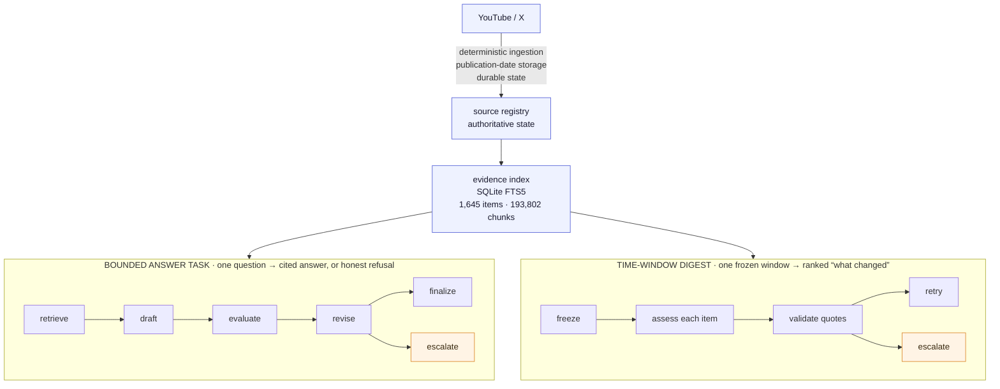

# LLM Gym — building a long-running agent that can be trusted, and measuring where it can't

> A local, evidence-backed research system built to find out what makes a
> long-running agent trustworthy — and to measure the places where it is not.
> Every claim below has a command beside it and an artifact you can check it
> against.

---

## How to use this document

**To present the project** — [Part 0](#part-0) is the narrative, [Part II](#part-ii)
the demonstrations, [Part IV](#part-iv) the failures worth recounting, and
[Part V](#part-v) the mapping to the company's problem.

**As a reference** — [Part III](#part-iii) explains how every piece fits;
[Part VII](#part-vii) is setup and the full command index.

Each command **block** appears once, under its own anchor, and is
cross-referenced everywhere else as **[▸ run](#part-vii)**. Source files are
linked as **[code]**. The one deliberate exception is
[the preflight](#cmd-preflight), which repeats three checks from
[the full offline surface](#cmd-offline-suite) so all three can be run in ten
seconds without scrolling.

**Contents**

- [Part 0 — What actually happens](#part-0)
  - [The run, step by step](#run-step-by-step)
  - [Who does what?](#who-does-what)
  - [Why did the label change?](#why-did-the-label-change)
  - [What does it show?](#what-does-it-show)
  - [Key concepts](#key-concepts)
  - [Key numbers](#key-numbers)
- [Part I — What this is, and what it isn't](#part-i)
  - [I.1 The brief, as stated](#i-1)
  - [I.2 What I built](#i-2)
  - [I.3 What this demonstrates, and what it does not](#i-3)
- [Part II — Guided demonstrations](#part-ii)
  - [II.0 Preparing a live demonstration](#ii-0)
  - [II.1 The loop that changes its mind](#ii-1) *(2 min)*
  - [II.2 Long-running: 328 items, killed, resumed, escalated](#ii-2) *(3 min)*
  - [II.3 Consistency across repeated runs](#ii-3) *(2 min)*
  - [II.4 GLM-5.2 against Claude Sonnet 5](#ii-4) *(3 min)*
  - [II.5 How accuracy is established](#ii-5) *(3 min)*
  - [II.6 Observability, traceability, auditability](#ii-6) *(2 min)*
  - [II.7 Where the human belongs](#ii-7) *(1 min)*
- [Part III — How every piece fits together](#part-iii)
  - [III.1 The pipeline, stage by stage](#iii-1)
  - [III.2 The three-way split — who owns what](#iii-2)
  - [III.3 The seven loops](#iii-3)
  - [III.4 The three prompt families](#iii-4)
  - [III.5 The two evaluation gates — and the one that is only declared](#iii-5)
  - [III.6 Why the query layer has no model in it](#iii-6)
  - [III.7 Budgets, and why the runs are short](#iii-7)
  - [III.8 What is committed, and why](#iii-8)
- [Part IV — Turning points: what broke, and what it produced](#part-iv)
  - [TP-1 — 126 green tests, zero successful live calls](#tp-1)
  - [TP-2 — The snippet that deleted the word "no"](#tp-2)
  - [TP-3 — The model was right and my benchmark was wrong](#tp-3)
  - [TP-4 — The comparison that compared two different benchmarks](#tp-4)
  - [TP-5 — A tie, correctly read — and then a second look that voided it](#tp-5)
  - [TP-6 — Seven specifications nobody executed](#tp-6)
  - [TP-7 — Green tests do not detect drift](#tp-7)
  - [TP-8 — Two counters disagreed, and one of them was lying](#tp-8)
  - [TP-9 — I generalised from one arm. Twice.](#tp-9)
  - [TP-10 — 107,682 characters, four fifths of it duplication](#tp-10)
  - [TP-11 — 328 items exposed four defects that 49 could not](#tp-11)
  - [TP-12 — The annotation unit was wrong, so the score would have been meaningless](#tp-12)
  - [The pattern across all twelve](#the-pattern)
  - [What I actually learned](#learnings)
- [Part V — The map to the company's problem](#part-v)
  - [V.1 The target pipeline, and where this project sits on it](#v-1)
  - [V.2 The consistency problem, answered with data](#v-2)
  - [V.3 Why "look at GLM 5.2" was the assignment](#v-3)
  - [V.4 The compounding-error math, with numbers](#v-4)
  - [V.5 Where the human belongs — and where they don't](#v-5)
  - [V.6 Where I add value](#v-6)
  - [V.7 Anticipated questions](#v-7)
- [Part VI — What comes next](#part-vi)
  - [VI.1 From an ML point of view](#vi-1)
  - [VI.2 From a human-in-the-loop point of view](#vi-2)
  - [VI.3 The one thing that would actually close the brief](#vi-3)
- [Part VII — Reference](#part-vii)
  - [VII.1 Setup from an empty checkout](#vii-1)
  - [VII.2 Building a corpus](#vii-2)
  - [VII.3 Running the agent](#vii-3)
  - [VII.4 Evaluation and review](#vii-4)
  - [VII.5 Repository map](#vii-5)
  - [VII.6 Document map](#vii-6)
  - [VII.7 Verification record](#vii-7)
  - [VII.8 Deterministic stages: run it, and inspect it](#vii-8)
  - [VII.9 Command index](#vii-9)

---

<a id="part-0"></a>
## Part 0 — What actually happens

This project collects public YouTube and X material about building and
operating LLM agents, indexes it locally, and answers questions from that
material **with citations — or refuses when the evidence is thin**. Ordinary
code owns every step except two: **reading evidence and judging it**, and
**writing search queries**. Those two are the model's entire job.

<a id="run-step-by-step"></a>
### The run, step by step

The question was: *"What does the corpus describe as the purpose of evals for
agent systems?"*

0. **[Code](#stage-ingest) builds the corpus.** Long before any question is asked, and with
   **no model anywhere in it.** A hand-edited table
   ([config/SOURCES.md](config/SOURCES.md)) lists **21 YouTube channels and 48 X
   accounts** — a person chooses the sources, not a prompt. For each one, code
   asks the platform API what was published inside the window, bounded to
   **3 days** so a run cannot quietly become a backfill. YouTube items are
   fetched with `yt-dlp`, preferring the published subtitles and falling back to
   **local Whisper transcription** when there are none; X posts are stored with
   their media, linked documents and article metadata, and attached video is
   transcribed the same way. Everything lands under
   `source/<platform>/<handle>/…/YYYYMMDD_<id>/`, dated by **publication, never
   by download**, and an item is only marked complete once its artifacts are
   finalised — so an interrupted download is retried rather than silently
   counted. `data/source-registry.sqlite3` is the authoritative record of what
   exists; each run resumes from the last publication timestamp, so re-running
   with nothing new produces an empty result rather than repeated work.
   [▸ download one day](#cmd-ingest-one-day) · [▸ the normal daily path](#cmd-ingest-all)

   Then a separate deterministic pass turns those files into something
   searchable: transcripts are split into chunks that keep their **timestamp
   locators**, posts and attachments become records, and the whole set is
   written to an **SQLite FTS5 index** with Porter stemming.
   Currently **1,645 records — 472 YouTube transcripts and 1,173 X posts —
   split into 193,802 searchable chunks.** The index is *derived*: it can be
   rebuilt from the files at any time, which is why it is not committed.
   [▸ build the index](#cmd-build-index)

1. **[Code](#stage-retrieval) searches.** The question text goes straight into that index.
   It returns the **8 best-matching passages**, one per source, ranked by BM25.
   **No model, no cost.**

   > **Why eight?** Cost is the obvious answer and it is not the binding one.
   > Each passage costs about **410 input tokens** — but it also *forces* about
   > **180 output tokens**, because the contract makes the model write one
   > judgement per passage. Output is capped at **4,000 tokens**, so the
   > response starts truncating at roughly **23 passages**. Measured: sets of
   > 26+ truncated in **5 of 7 runs**; **≤25 always completed**. Three more
   > reasons stack on top — deeper retrieval on a weak query adds noise rather
   > than signal, a human has to be able to read the set, and the merged cap
   > later has to leave room. **What is not known is the minimum that still
   > answers well on the first try. That experiment has not been run**, and it
   > is the right one. [The full argument →](#cmd-evidence-cap)

2. **The model reads those 8 passages.** One prompt, one call. It marks each
   passage **usable or not, with a reason**, writes an answer from the usable
   ones, labels the evidence set, and — because the prompt invites it — returns
   **up to 3 sharper search queries**. Here: **2 of 8 usable**, label
   **`INSUFFICIENT_EVIDENCE`**, and 3 queries.

   > **The three labels, and what each one means.** All three describe **only
   > the passages placed in the prompt** — never the corpus, and never the world.
   > That scoping is why a label can change between rounds without either round
   > being wrong. [Why the label changed →](#why-did-the-label-change)
   >
   > | Label | Meaning | Does it stop the loop? |
   > |---|---|---|
   > | **`SUPPORTED`** | The supplied passages answer the question, without material disagreement between them | **Yes** |
   > | **`CONFLICTING_EVIDENCE`** | The supplied passages make materially different claims. *"The sources disagree"* is itself an answer | **Yes** — this surprises people |
   > | **`INSUFFICIENT_EVIDENCE`** | The supplied passages do not establish an answer either way | **No** — this is the one that triggers another search |
   >
   > A fourth value is not possible: the response is rejected outright if the
   > label is anything else. The digest uses a **different** four-value set —
   > `SIGNIFICANT` / `INCREMENTAL` / `UNSUPPORTED` / `PROMOTIONAL` — for a
   > different question. [That set →](#label-calibration)

3. **[Code](#stage-control) checks two things**, and both must hold to stop:
   the label must **not** be `INSUFFICIENT_EVIDENCE`, **and** at least
   `min(3, n)` passages must have been marked usable. Note it is *not* "must be
   `SUPPORTED`" — **`CONFLICTING_EVIDENCE` also stops the loop**, because
   *"the sources disagree"* is an answer.

4. **Here both conditions failed** — only 2 usable, and the label said
   insufficient — **so the one genuinely agentic loop in this project fires.**

5. **[Code](#stage-retrieval) runs the model's 3 queries** against the same index, merges the
   results with the **8 it already had**, drops duplicates, and stops at **20**.
   Nothing from round one is discarded; the 20 are **8 original + 12 new**. The
   third query contributed nothing, because the cap filled during the second.

6. **The model reads the 20 passages.** Same prompt, same question, plus a note
   that new evidence arrived. Now **8 of 20 usable**, all 8 cited, label
   **`SUPPORTED`**.

7. **[Code](#stage-control) stops.** Eight usable clears the bar of three and the label is no
   longer insufficient, so the question is answered and the run ends. Stop
   reason: **`QUALITY_GATE_PASSED`**. The model had proposed **three more
   queries** — it wanted to keep going. It did not get to.

**Two minutes, twelve cents, three billed calls.** Three, not two: one
round-two response came back malformed, so code fed the exact validation error
back and made the model try again.

**Then open the trace.** [▸ the adaptive trace](#cmd-trace-adaptive)

**And the three things this project taught me that a test suite could not.**
[▸ what I actually learned](#learnings)

**To run the same 13 frozen cases through a second model and compare the two
arms.** [▸ compare models](#cmd-model-comparison)

**Or through two prompt versions on one model.**
[▸ compare prompts](#cmd-prompt-comparison)

**Today the digest labels 30% (too much?) of a month `SIGNIFICANT` and ranks oldest-first, 
so it filters without prioritising.** [▸ what the distribution says](#label-calibration)

<a id="who-does-what"></a>
### Who does what?

The model does two things: it reads and judges evidence, and it writes search
queries.

Code does everything else. Code decides what evidence the model sees and how
much of that evidence. Code runs the searches — the model produced three
strings and had no way to execute them. Code counts the usable passages,
decides when to stop, enforces the budget, and writes the record.

**Nothing the model returns is taken on trust.** Citations must point at passages
that were actually supplied. There must be exactly one judgement per passage,
no more and no fewer. The label must be one of three allowed words. Break any
of those and the answer is thrown away and re-requested with the error
attached. That happened once in this run.

<a id="why-did-the-label-change"></a>
### Why did the label change?

It looks like the system contradicted itself. It didn't.

**The label describes only the passages in front of the model at that moment.**
Round one said: *these 8 don't answer the question*. Round two said: *these 20
do*. **Both are true.** The two sources cited in round one are still cited in round
two — nothing was withdrawn.

What changed was the search. The original question asks *"what does the corpus
describe"*, so the search engine looked for the words "corpus" and "describe" —
words about the question, not about the subject. The model's rewrites dropped
that framing and searched for words that would appear in an answer: *"why do we
run evals"*, *"evals purpose measuring performance reliability"*. Five of the
six new sources came from one of those rewrites.

**The first search looked for the words in the question. The model rewrote the
query to look for the words in the answer.** [▸ replay all four queries](#cmd-replay-queries)

<a id="what-does-it-show"></a>
### What does it show?

The system noticed its own information wasn't good enough and changed what it
did next. That is the difference between an agent and a script.

It does not show long-horizon reasoning. **This loop is two rounds deep and stops
there by design.**

<a id="key-concepts"></a>
### Key concepts

| # | Claim | Prompt in that flow | Receipt |
|---|---|---|---|
| 1 | The loop visibly changes its own next action | `synthesis-v7` — *not recorded in the artifact*, see [the provenance gap](#cmd-provenance-coverage) | [▸ trace](#cmd-trace-adaptive) · [▸ state transition](#cmd-trace-transition) |
| 2 | A long run survived a kill and failed honestly | `significance-v1` | [▸ 30-day report](#cmd-30day-report) · [▸ why items failed](#cmd-why-rejected) |
| 3 | Deterministic checks passed and a human still found the gap | `significance-v2` produced the assessments; the audit itself is **N/A — human only** | [▸ human audit](#cmd-audit-report) · [▸ the two checks disagreeing](#cmd-provenance-vs-support) |
| 4 | GLM-5.2 changed the economics without winning on quality | `synthesis-v7`, identical across both arms | [▸ provider summaries](#cmd-provider-summaries) · [▸ the behavioural difference](#cmd-trigger-stability) |
| 5 | Ambiguous judgement and production action stay with the human | `significance-v2` for the digest escalation; the trajectory fixture is **N/A — deterministic** | [▸ escalation package](#cmd-show-digest-rejected) |
| 6 | The `SIGNIFICANT` label does not yet narrow what to read | `significance-v1` and `significance-v2` | [▸ selectivity](#cmd-digest-selectivity) · [▸ arm comparison](#cmd-label-arms) |

Retrieval, indexing, window freezing, ranking, budgets and every validation gate
are **N/A — deterministic**; no prompt is involved at any point in those.
[Who owns what →](#part-iii)

**Why two different `significance` versions appear.** Not a bug and not stale
code — the digest runner always loads the *latest* registered prompt. The rows
differ because they are **dated artifacts**: `significance-v1` was written
2026-08-17 14:37 UTC and the three v1 runs followed at 15:30, 15:33 and 16:19
the same day. `significance-v2` was written 2026-08-18 16:00 UTC, and the v2 run
started an hour later. A digest launched today would use v2.
[▸ verify that each report names the prompt it really used](#cmd-prompt-provenance-check)

<a id="key-numbers"></a>
### Key numbers

| | |
|---|---|
| Corpus | 1,645 evidence records (472 YouTube transcripts, 1,173 X posts), 193,802 chunks |
| Longest run | 328 items, 321 accepted, 7 unresolved, 24.7 min provider time, **$1.73**, escalated |
| Quote fabrication caught | **6 of 328 = 1.8%**, every one, deterministically |
| Human audit | 20 cards → 18 in scope → **11 fully supported**, 6 partial, 1 unsupported |
| Blind label agreement | **8/18 exact**, 18/18 judged reasonable after reveal |
| GLM-5.2 vs Sonnet 5 | **4.1× cheaper**, 1.8× faster throughput, 6 runs per arm |
| Offline tests | **390 passed, 61 subtests**, 2.7 s, no network |
| Recorded spend | **$3.82** across committed model-run reports, plus **$1.55** estimated X API cost in the run log = **$5.37** recorded. Uncommitted and superseded runs are not included, so treat it as a floor, not a total. |

---

<a id="part-i"></a>
## Part I — What this is, and what it isn't

<a id="i-1"></a>
### I.1 The brief, as stated

From the last conversation, the assignment was explicit:

> *"Determine a long running agent... reliably, accurately performing
> long-running horizon tasks."*

and the target shape was named precisely:

> *"Discovery → mapping → reconciliation → reporting → actions. Discovery,
> prioritization we can do. Resolution we can do, but not in a reliable way
> yet — and not just us, industry-wide."*

Plus three specific sub-asks: make repeated runs **consistent**; look at
**GLM-5.2**; and treat **observability, traceability, auditability** as the
precondition for ever letting an agent act.

This project is the answer built against that brief, using public AI/agent
content as the evidence domain instead of compliance artifacts — because the
task *shape* transfers and the data was obtainable.

<a id="i-2"></a>
### I.2 What I built



Neither the index (192 MB) nor the downloaded media is committed — both are
regenerable. **Selected model output is committed** — digest reports, live-run
traces, evaluation reports, verification drafts and human labels — because
that output cost money and is the evidence of the work. Per-task caches and working
files are not: `data/research-answer.json`, `data/agent-task-cache.json` and
`data/eval-suite/**` are gitignored, because they duplicate the committed
reports.

<a id="i-3"></a>
### I.3 What this demonstrates, and what it does not

| Claim I will make | Claim I will not make |
|---|---|
| A long workload survives interruption, budget limits and validation failure | That it is a dependent chain — the digest is a parallel map, depth 1 |
| One loop observes its own output and changes its next action | That the chain is deep — it is depth 2 |
| Every accepted digest quote is [found in its source](#quote-matching), under a whitespace- and case-normalized match | That the quotes are character-exact — 312 of 321 are in the 30-day report — or that the significance *label* is calibrated |
| Deterministic checks caught 1.8% fabricated quotes | That precision or recall over developments is known — no gold set exists |
| GLM-5.2 is 4.1× cheaper on this workload | That GLM-5.2 is better — 6 runs, 2 cases, no quality ruler |

There is also no scheduler, no UI, no MCP façade and **no autonomous production
action**. Those are deferred in [ROADMAP.md](ROADMAP.md) with named triggers,
not forgotten.

---

<a id="part-ii"></a>
## Part II — Guided demonstrations

**Demo jump strip:**
[prep](#ii-0) · [1 show me](#ii-1) · [2 long-running](#ii-2) ·
[3 consistency](#ii-3) · [4 GLM-5.2](#ii-4) · [5 accuracy](#ii-5) ·
[6 observability](#ii-6) · [7 the human](#ii-7)

<a id="ii-0"></a>
### II.0 Preparing a live demonstration

A previous session lost roughly 15 minutes to screen sharing. A failed
demonstration undercuts a project about observability, so:

1. **Zoom, not Meet.** Meet's window-share failed twice; Zoom worked.
2. **Share the whole screen**, not a window. Window-share is what broke.
3. **Terminal font at 18pt+**, dark background, `cd` into the repo already done.
4. **Pre-run every command once** so it is in shell history — then `Ctrl-R`
   instead of typing.
5. **Pre-open**, in tabs: the 30-day report, the audit report, one adaptive
   trace.
6. **Fallback**: a 90-second screen recording of the kill-and-resume sequence,
   in case the live run cannot be shown.

<a id="cmd-preflight"></a>
**Preflight, the morning of** — free, ~10 seconds

```bash
.venv/bin/python -m pytest -q
.venv/bin/python scripts/eval_validate_suite.py --check-retrieval | jq .
.venv/bin/python scripts/check_environment_configuration.py
```

If any of these are red, do not demo live — use the artifacts, which are
committed and cannot break.

---

<a id="ii-1"></a>
### II.1 The loop that changes its mind *(2 min)*

**Why this comes first.** This is the only thing in the repository that is unambiguously
agentic, and it answers the implicit question — *why is this an agent and not a
for-loop?*

<a id="cmd-trace-adaptive"></a>
**The trace** — free

```bash
jq -C . data/runs/trigger-measurement/agent/what_are_evals-rep-1.json | less -R
```

<a id="cmd-trace-transition"></a>
**Just the state transition, for the short version** — free

```bash
.venv/bin/python - <<'PY'
import json
trace = json.load(open("data/runs/trigger-measurement/agent/what_are_evals-rep-1.json"))
print(f"evidence: {trace['evidence_count_initial']} -> {trace['evidence_count_final']}")
for r in trace["rounds"]:
    print(f"round {r['round']}: classification={r['classification']}, "
          f"relevant={r['relevant_evidence_count']}/{r['assessed_evidence_count']}, "
          f"suggested_queries={r['suggested_queries']}")
print("queries executed:", trace["refined_queries"])
print("stop reason:", trace["stop_reason"])
PY
```

**What happened, in four beats:**

1. Round one got 8 items. The model marked **2 relevant**, said
   `INSUFFICIENT_EVIDENCE`, and returned three focused queries.
2. Python took those query *strings*, searched the local index, deduplicated,
   and expanded the evidence **8 → 20** — the cap.
3. Round two saw the same question, the bigger evidence set, and feedback
   saying new evidence had arrived.
4. Round two marked **8 relevant** and returned `SUPPORTED`.

**The key point:** *"**The model never retrieved anything.** The model
produced three strings. Code decided they were allowed, ran them, deduplicated, capped
at twenty, and built the next prompt. That's the split I'd defend in
production — the model proposes, ordinary code disposes."*

<a id="cmd-rg-controller"></a>
**To show the code behind it** — free

```bash
grep -n -C 8 -E "new_queries =|expanded = _merge_evidence|revision_feedback =" \
  llm_gym/agent/retrieval_retry.py
```

**Expected pushback — "that's depth two, not long-horizon."** Agree
immediately: *"Correct. Depth two. The long-horizon claim is the next demo, and
it's breadth, not depth — I'll name the difference myself."*

---

<a id="ii-2"></a>
### II.2 Long-running: 328 items, killed, resumed, escalated *(3 min)*

<a id="cmd-30day-report"></a>
**The 30-day stress report** — free

```bash
.venv/bin/python scripts/show_digest.py \
  data/digests/2026-07-08-to-2026-08-07-youtube-glm-5.2-open-weight-report.json \
  --label ALL | less
```

`--label ALL` because the point here is the *whole* run. The default view shows
only `SIGNIFICANT` and would hide 222 of the 321 assessments — fine when
choosing what to read, wrong when the claim is "every item was attempted".
Expect about 4,750 lines, hence `less`; the header and the selection line are
the first twenty.

| | |
|---|---|
| Selected | 328 items, 19 channels, one frozen window |
| Accepted | 321 |
| Unresolved | 7 (10 rejection records) |
| Provider time | 1,479 s ≈ 24.7 min |
| Tokens | 858,368 in / 62,345 out |
| Cost | $1.7308288 |
| Outcome | `ESCALATED_FOR_REVIEW` |

**The kill-and-resume story:** killed at **57/328** with $0.3445 spent. The
checkpoint was valid JSON with `outcome=RUNNING` and the in-flight item
recorded. **No report was written** — correct, because the run had not reached
a terminal state. Resumed with the identical command, no flags: `run_id`
unchanged, nothing reassessed, spend carried forward rather than restarted.

<a id="cmd-resume-evidence"></a>
**What the committed record actually proves** — free

```bash
R=data/digests/2026-07-08-to-2026-08-07-youtube-glm-5.2-open-weight-report.json
RID=$(jq -r '.loop.run_id' $R)

# 1. more than one terminal event, same run identity
grep "$RID" data/run-log.jsonl | jq -r '"\(.logged_at[0:19])  \(.status)  run=\(.run_id[0:8])"'

# 2. the report's own clocks disagree, which only a resume causes
jq -r '"started  \(.started_at[0:19])\nfinished \(.finished_at[0:19])\nelapsed_seconds recorded: \(.elapsed_seconds)\nprovider latency total  : \(.usage_totals.model_latency_seconds)"' $R
```

```
2026-08-17T16:48:30  FAILED_BUDGET          run=a0c689eb
2026-08-17T17:04:41  ESCALATED_FOR_REVIEW   run=a0c689eb

started  2026-08-17T16:19:05
finished 2026-08-17T17:04:41          → 2,736 s wall
elapsed_seconds recorded: 84.827      → the last invocation only
provider latency total  : 1479.047    → 21 min when nothing was purchased
```

**Read that honestly, because it is not the whole story.**

*Proved by the artifacts:* the run reached a terminal state **twice** under one
`run_id`, 16 minutes apart, and the report preserves the original `started_at`
while its `elapsed_seconds` covers only the final invocation. Nothing but a
resume produces that combination — a fresh run would mint a new `run_id` and
its wall clock would match its elapsed time.

*Not proved by the artifacts:* the `Ctrl-C` at item 57. The first terminal
status on record is `FAILED_BUDGET` — the off-by-one described in
[TP-11](#tp-11) — not an operator interrupt. The manual kill happened, but it
is in private notes, so present it as **operator-observed, not
repository-verifiable**.

*Also not proved:* that nothing was re-purchased. `provider_calls` is `null` on
this legacy report, so its call count is a recovered lower bound. The exact
accounting arrived later, and the seven-day v2 report is where the shape is
checkable: **49 items → 53 attempts → 75 provider calls**, with
`provider_calls_exact: true`. Repeated work would show up there as calls far
above attempts. [▸ the counters](#cmd-accounting-counters)

If someone wants the claim proved rather than inferred, the answer is to run it
in front of them.

<a id="cmd-resume-live"></a>
**Repeat the experiment live** — **paid**, a few cents on a 5-item window

```bash
# 1. freeze the smallest real window: 5 items
.venv/bin/python scripts/corpus_freeze_digest_window.py \
  --since 2026-08-06 --until 2026-08-07 --platform youtube | jq .
W=data/digest-windows/2026-08-06-to-2026-08-07-youtube.json

# Name the prompt version and both artifacts explicitly. Artifact paths carry
# the version, so the v1-era filenames are not the ones a run produces today.
P=significance-v2
C=data/digests/2026-08-06-to-2026-08-07-youtube-glm-5.2-open-weight-$P-checkpoint.json
R=data/digests/2026-08-06-to-2026-08-07-youtube-glm-5.2-open-weight-$P-report.json

# 2. clear only this run's own artifacts, so the demo starts cold.
#    Never glob here: the committed v1 report shares this window's prefix.
rm -f "$C" "$R"

# 3. start it — press Ctrl-C after the second or third item scrolls past
.venv/bin/python scripts/agent_run_digest.py \
  --snapshot "$W" --model glm-5.2 --provider-prefix OPEN_WEIGHT \
  --prompt-version "$P" --checkpoint "$C" --output "$R"

# 4. THIS is the proof: what was banked before the interrupt
jq '{run_id: .loop.run_id, outcome, items_assessed, cost_usd, current_item}' "$C"

# 5. rerun the identical command, no flags changed
.venv/bin/python scripts/agent_run_digest.py \
  --snapshot "$W" --model glm-5.2 --provider-prefix OPEN_WEIGHT \
  --prompt-version "$P" --checkpoint "$C" --output "$R"

# 6. compare against step 4
jq '{run_id: .loop.run_id, outcome, items_total, items_assessed, cost_usd}' "$R"
```

Three things to point at when step 6 prints:

| Field | What proves the resume |
|---|---|
| `run_id` | **Identical** to step 4. A fresh run mints a new one. |
| `items_assessed` | 5 of 5, but the items banked at step 4 were never re-sent |
| `cost_usd` | Final total ≈ step-4 cost **plus the remainder only**. A restart would cost the full $0.028 again on top |

For scale only: the committed 1-day run finished at **$0.027794 for 5 items**,
about $0.0056 each — but that was **`significance-v1`**, which emits one quote
rather than one to three mapped passages, so it is a historical reference and
not a predicted v2 cost. What to watch is the *shape*: the step-6 total should
be roughly the step-4 checkpoint total plus the remaining items, not the two
added on top of a full restart.

<a id="cmd-show-checkpoint"></a>
**What the checkpoint actually holds** — free, local only

```bash
.venv/bin/python -c "
import json; d=json.load(open('data/digests/2026-07-31-to-2026-08-07-youtube-glm-5.2-open-weight-significance-v2-checkpoint.json'))
skip={'assessments','rejected','provider_usage','ranked','window','evaluation_note'}
print(json.dumps({k:v for k,v in d.items() if k not in skip}, indent=1))"
```

`cache_key` is the fingerprint of everything that could change the answer — a
checkpoint whose key differs belongs to a different run even at the same path,
so it is neither reused nor resumed.

<a id="cmd-digest-run"></a>
**To run it live** — **paid**, ~$0.03 for a 1-day window

```bash
.venv/bin/python scripts/agent_run_digest.py \
  --snapshot data/digest-windows/<window>.json \
  --model glm-5.2 --provider-prefix OPEN_WEIGHT
# Ctrl-C partway, then run the identical command again
```

Freeze the window first: [▸ freeze](#cmd-freeze) · [▸ estimate](#cmd-digest-estimate).

**The boundary, stated up front.** *"This is 328 independent calls. The
prompt forbids an item from seeing the others, so reliability is additive — one
rejection in 49 stayed one rejection instead of poisoning the other 48. There's
no 0.9ⁿ here because there's no n. It proves duration, checkpointing, budget
enforcement and safe failure. It does not prove compounding reasoning, and the
thing that would change that is supersession — assessing each item against what
has accumulated. That's the next build, and it's what turns depth 1 into depth
328."*

---

<a id="ii-3"></a>
### II.3 Consistency across repeated runs *(2 min)*

This is the live product problem raised in the brief: *the first run says
compliant, the second non-compliant, the third partially compliant.* Three fixes
were named there — evals, the context layer, and caching. Answer with data on
all three.

**First, split the question.** Some inconsistency is *correct*: a run that
refuses on thin evidence and a run that answers are not both wrong. What must be
consistent is the **classification given identical inputs**.

<a id="cmd-compare-prompt-arms"></a>
**Measured consistency across repeated uncached runs** — free

```bash
.venv/bin/python scripts/eval_compare_prompt_arms.py \
  --arm-a data/eval-synthesis-v5-rep-1-report.json \
          data/eval-synthesis-v5-rep-2-report.json \
          data/eval-synthesis-v5-rep-3-report.json \
  --arm-b data/eval-synthesis-v6-rep-1-report.json \
          data/eval-synthesis-v6-rep-2-report.json \
          data/eval-synthesis-v6-rep-3-report.json \
  --output /tmp/eval-comparison-synthesis-v5-vs-synthesis-v6.json
```

<a id="cmd-effective-prompt"></a>
**Which prompt actually reached the model** — free

```bash
.venv/bin/python - <<'PY'
import json, glob, collections
for arm in ("v5", "v6"):
    eff, shas = collections.Counter(), set()
    for f in glob.glob(f"data/eval-synthesis-{arm}-rep-*-cache/**/*.json", recursive=True):
        for a in json.load(open(f)).get("attempts", []):
            syn = a.get("synthesis") or {}
            if syn.get("prompt_version"):
                eff[syn["prompt_version"]] += 1
            sha = (syn.get("prompt") or {}).get("prompt_sha256")
            if sha:
                shas.add(sha)
    print(f"nominal {arm}: rendered {dict(eff)}  distinct prompt SHAs {[x[:12] for x in shas]}")
PY
```

Both print `{'synthesis-v6': 39}` and the same SHA.

**13/13 classification-consistent cases in each group**, 33/39 expected-outcome
matches in each, **zero discriminating cases**.

**What these six runs actually are — not what the filenames claim.** They were launched as a `synthesis-v5` versus `synthesis-v6`
comparison. They are not one. `run_agent_task()` resolves the requested prompt
version, uses it for the cache key, the revision templates and the report
header — and then never passes it into `SynthesisRequest`, which falls back to
the module default. Every one of the 78 stored attempts across both groups
records effective prompt `synthesis-v6` with an identical prompt SHA.
[▸ prove it](#cmd-effective-prompt)

So the comparison is void, and what remains is **six uncached repetitions of
the same prompt** — which is a *better* consistency measurement than three, and
it is the number worth quoting here. What it cannot support is any claim about
v5 versus v6.

This is [TP-4](#tp-4) recurring one level deeper, and the recurrence is worth
telling that way: last time the unguarded variable was `suite_version`, a field nobody
recorded. This time the field *was* guarded and *was* recorded — it just never
reached the model. **A provenance field is only worth what the code does with
it.** The fix is two lines in `agent_runner.py` plus a test asserting the
rendered prompt matches the requested version; the honest reporting of the six
runs does not wait for the fix.

**The part that usually goes unsaid:** *"**A cache hit tells you nothing
about consistency.** A cache deliberately returns the earlier validated answer for
identical inputs — that's a compute optimisation, and the right one, but
caching measures storage, not the model. Consistency has to be measured with
repeated **uncached** runs over frozen inputs, which is what that number is."*

**The harder finding, which is about architecture:** the model's own
self-reported signals are not stable — *which* signal is stable varies by model
and by case. So the loop keys expansion on the **union** of two signals rather
than either alone. [▸ show the instability](#cmd-trigger-stability)

<a id="cmd-model-comparison"></a>
**Compare two model/provider arms on the same 13 cases** — **paid**, roughly
$0.10–0.20 per report

Each arm names the environment that served it, and the comparator derives which
variable moved rather than being told. Three **one-repetition** reports per arm:
the trial denominator is cases × reports, so the comparator refuses a report
containing more than one repetition rather than miscounting it.

**The timestamped run directory is not tidiness.** The suite runner resumes from
its state file, so rehearsing into the same paths makes the live run skip every
case, issue **zero model calls**, and still print `SUITE_COMPLETE` with 13
results and no cache hits — a report indistinguishable from a fresh one. A fresh
directory is the only thing that prevents demonstrating a replay.

```bash
set -e
RUN_DIR="data/model-comparison/run-$(date -u +%Y%m%dT%H%M%SZ)"
mkdir -p "$RUN_DIR"

for rep in 1 2 3; do
  .venv/bin/python scripts/eval_run_suite.py --suite config/agent_eval_suite.json \
    --provider-prefix AGENT --model claude-sonnet-5 --prompt-version synthesis-v7 \
    --repetitions 1 --max-cost-usd 1.0 \
    --output "$RUN_DIR/sonnet-rep-$rep-report.json" \
    --state  "$RUN_DIR/sonnet-rep-$rep-state.json" \
    --cache-dir "$RUN_DIR/sonnet-rep-$rep-cache"

  .venv/bin/python scripts/eval_run_suite.py --suite config/agent_eval_suite.json \
    --provider-prefix OPEN_WEIGHT --model glm-5.2 --prompt-version synthesis-v7 \
    --repetitions 1 --max-cost-usd 1.0 \
    --output "$RUN_DIR/glm-rep-$rep-report.json" \
    --state  "$RUN_DIR/glm-rep-$rep-state.json" \
    --cache-dir "$RUN_DIR/glm-rep-$rep-cache"
done

.venv/bin/python scripts/eval_compare_prompt_arms.py \
  --arm-a "$RUN_DIR"/sonnet-rep-*-report.json \
  --arm-b "$RUN_DIR"/glm-rep-*-report.json \
  --output "$RUN_DIR/sonnet-vs-glm-synthesis-v7.json"
```

The comparator now refuses the ways this can go quietly wrong: a report that did
not reach `SUITE_COMPLETE`, one whose `completed_tasks` and `total_tasks`
disagree, more than one repetition per report, unequal report counts between
arms, an arm whose attempts rendered two different prompts, and a model
comparison whose arms did not actually render the same prompt. It reads the
**effective** prompt version out of each stored attempt rather than trusting the
report header — that header once named one version while every attempt rendered
another, which is what invalidated this repository's only prompt comparison.
[TP-5 →](#tp-5)

Then check the artifact reports **39 trials per arm**, and that
`arm_a_effective_prompt` and `arm_b_effective_prompt` are the same single
version.

It is a **model/provider-arm** comparison, not a model comparison: switching
from Claude to GLM changes both the model and the service serving it, and
nothing here separates those two variables.

**What an identical score would license you to say**, and nothing more:

> *On these 13 frozen answer cases, across three uncached repetitions per model
> — 39 outputs per arm — the two models had the same observed
> expected-classification score. No difference was detected on this sample.*

You may also compare per-case stability, retries, cost, calls and throughput.
You may **not** say the models are equivalent, that their answer quality is
equal, that the suite cannot distinguish them, or that 39 repetitions are 39
independent cases. **The unit of generalisation is the case, so the breadth is
13, not 39.** The seven trajectory cases are not exercised by this run, and
semantic claim support is not compared by anything here.

**And the honest size caveat**, which belongs in the same breath:

> Treat this 13-case run as a proof of execution only; before interpreting
> model-quality differences, expand to at least **170 independent cases**, which
> gives roughly 80% power at a two-sided 5% significance level to detect a
> 15-percentage-point accuracy difference near a 50% baseline. Repeating the
> same cases measures run-to-run variance but does not increase the number of
> independent cases.

<a id="cmd-prompt-comparison"></a>
**Compare two prompt versions on one model** — **paid**, measured at **$0.198**

Same 13 cases, same model and arm, three one-repetition reports per prompt. The
script derives the arm names from a single array, so the run loop and the
comparison cannot drift apart, and it writes to a fresh timestamped directory
for the reason given above.

```bash
./run_prompt_comparison.sh          # defaults: glm-5.2 via OPEN_WEIGHT, v6 vs v7
# override with: MODEL=... PROVIDER_PREFIX=... ARM_A=... ARM_B=... ./run_prompt_comparison.sh
```

**This has been run.** `synthesis-v6` against `synthesis-v7`, GLM-5.2, six
reports, 78 tasks, **$0.1985**:

```
Consistency: arm_a 12/13; arm_b 11/13
Unstable/noise cases: insufficient_exact_latency, unsupported_causal_claim
All cases: arm_a 37/39 vs arm_b 36/39
Discriminating cases: 0 — arm_a 0/0 vs arm_b 0/0
```

Three things to say about that, in order.

**1. The provenance proves the arms were actually different**, which no previous
comparison in this project could:

```
arm_a_prompt_version: synthesis-v6   arm_a_effective_prompt: ["synthesis-v6"]
arm_b_prompt_version: synthesis-v7   arm_b_effective_prompt: ["synthesis-v7"]
```

The header and the rendered prompt agree. Before the binding fix they did not —
both arms of the committed v5/v6 reports rendered `synthesis-v6`, and the
comparator now surfaces that. [TP-5 →](#tp-5)

**2. Zero discriminating cases, again — and this time the number means
something.** Eleven of 13 cases pass under both prompts; two are unstable
*within* an arm, so they measure sampling noise rather than the prompt. The
effective comparison instrument is **zero cases of 13**. 37/39 versus 36/39 is
one flip on a noisy case, not a result. **The honest reading is that the suite
cannot distinguish these two prompts** — which is a fact about the suite, since
v6 and v7 differ by one clause about when to suggest queries.

**3. One case escalated legitimately, and it is the interesting one.** Under
`synthesis-v7`, `insufficient_exact_latency` failed all three rounds —
*"model response requires citation_ids"*, then an evidence-assessment coverage
failure, then citations again — and the runtime escalated with
`QUALITY_GATE_NOT_REACHED` rather than inventing an answer. That case expects
`INSUFFICIENT_EVIDENCE`, and the output contract makes `citation_ids` a critical
gate. **A model answering "the supplied evidence does not establish this" may
reasonably return no citations, and the contract rejects it.** Claude resolves
the tension by citing the passages *to explain* their insufficiency; GLM returns
none and fails. That is a real contract defect surfaced by changing the model —
tracked in [ROADMAP.md](ROADMAP.md), not patched here.

<a id="cmd-consistency-run"></a>
**Run a fresh measurement live** — **paid**, capped at $1

```bash
.venv/bin/python scripts/eval_run_suite.py \
  --model claude-sonnet-5 --prompt-version synthesis-v7 \
  --repetitions 3 --max-cost-usd 1.0 \
  --output data/explore-consistency-report.json \
  --state data/explore-consistency-state.json \
  --cache-dir data/explore-consistency-cache
```

**Cache demo (free):** rerun [▸ synthesize](#cmd-synthesize) unchanged and point
at `"cache_hit": true`. The key covers task, question, evidence IDs, model,
prompt version, evaluation policy **and every budget limit** — change any one
and the cached answer is correctly refused.

---

<a id="ii-4"></a>
### II.4 GLM-5.2 against Claude Sonnet 5 *(3 min)*

This was requested by name. Lead with *why it was requested*, not the price
list.

**Why it was requested:** open weights under MIT means it can run
**on-premise**, which is the only deployable option for regulated customers. Cost is the second
reason, not the first. GLM-5.2: released mid-June 2026, 744B MoE (~40B active),
MIT licence, 1M context.

<a id="cmd-provider-summaries"></a>
**The two arms side by side** — free

```bash
jq -C . data/runs/trigger-measurement/agent/summary.json | less -R
jq -C . data/runs/trigger-measurement/open_weight/summary.json | less -R
```

Same 2 cases, 3 repetitions each, identical **round-one** evidence, identical prompt
(`synthesis-v7`), separate output directories, no shared configuration:

| | Claude Sonnet 5 | GLM-5.2 |
|---|---|---|
| Provider calls | 14 | 10 |
| Cost | $0.540322 | **$0.130997** |
| Output throughput | 67.88 tok/s | **123.83 tok/s** |
| Validation errors | 1 | 0 |
| Round-one labels | 1 SUP, 5 INSUF | 2 SUP, 2 INSUF, 2 CONF |

**4.1× cheaper, 1.8× faster by throughput.** Then immediately refuse to declare
a winner, and explain why with the next command.

<a id="cmd-trigger-stability"></a>
**The finding that is actually about system design** — free

```bash
.venv/bin/python - <<'PY'
import json
for arm in ("agent", "open_weight"):
    d = json.load(open(f"data/runs/trigger-measurement/{arm}/summary.json"))
    s = d["summary"]
    print(f"\n{d['model']}   triggers={s['trigger_counts']}  expanded={s['expanded']}/{s['runs']}")
    for r in d["runs"]:
        print(f"   {r['case_id']:24} rep{r['repetition']}  "
              f"label={r['round_one_classification']:22} relevant={r['round_one_relevant']}/8  -> {r['trigger']}")
PY
```

Read it aloud, column by column:

- **Sonnet, `independent_evaluation`**: label constant `INSUFFICIENT_EVIDENCE`
  ×3, relevance count swings **3 → 5 → 1**.
- **Sonnet, `what_are_evals`**: relevance constant at 2/8, label **flips** to
  `SUPPORTED` on rep 3.
- **GLM, `independent_evaluation`**: relevance constant at 4/8, label flips on
  rep 3.

*"Neither self-reported signal is stable, and which one is stable flips between
cases and vendors. So expansion fires on the union — label says insufficient
**or** fewer than three items judged relevant. Six runs, two vendors, four
distinct input combinations, one identical expansion decision. The redundancy
absorbed instability either input alone would have passed straight into control
flow. And the union fails in the safe direction: toward gathering more evidence rather
than answering on thin evidence. For compliance work that's the right way
round."*

**The judgement call:** *"GLM declaring `SUPPORTED` on two
relevant items out of eight is the more optimistic call. For your audits,
Claude's conservatism is arguably the safer failure mode. So a provider
comparison that reports only cost and latency is measuring the wrong things —
**escalation rate belongs in that table**. Cheaper and faster isn't better if
the cheaper model is also more willing to answer on thin evidence."*

That connects directly to the mixture-of-experts point raised in the brief:
right model for the right task, and the selection criterion should include *how it fails*.

<a id="cmd-measure-trigger"></a>
**Reproduce it** — **paid**, $1 cap per arm

```bash
.venv/bin/python scripts/agent_measure_retrieval_trigger.py \
  --model claude-sonnet-5 --cases what_are_evals independent_evaluation \
  --repetitions 3 --max-cost-usd 1.0 --provider-prefix AGENT \
  --output-dir data/runs/explore-model-comparison/agent

.venv/bin/python scripts/agent_measure_retrieval_trigger.py \
  --model glm-5.2 --cases what_are_evals independent_evaluation \
  --repetitions 3 --max-cost-usd 1.0 --provider-prefix OPEN_WEIGHT \
  --output-dir data/runs/explore-model-comparison/open_weight
```

Separate `--output-dir` per arm is not tidiness — mixing two arms in one
directory once corrupted a comparison, and the wreckage is kept on purpose in
`data/runs/trigger-measurement/archive-mixed/`. [The story →](#tp-4)

---

<a id="ii-5"></a>
### II.5 How accuracy is established *(3 min)*

#### What "accuracy" means here, and why it has to be established

Every digest entry makes a claim of a particular shape:

> *"This source reports **X**. It matters because **Y**. Here are one to three
> passages from the source that show it."*

**Accuracy is whether that claim is warranted by the source.** It has to be
established rather than assumed because the entire proposition of a digest is
*you do not have to read the sources*. If an entry can be confidently wrong, a
reader has to go and check the source anyway — and then the digest is not merely
useless, it is worse than nothing, because it is a wrong answer delivered with
citations attached.

The compliance shape is identical. *"Control 7.2 is partially met; here is the
evidence"* fails in exactly the same ways, with higher stakes.

**A claim of that shape can be wrong in five distinct ways.** They are not
degrees of the same error; they are different failures needing different fixes:

| # | Failure | Can code detect it? | Measured here? |
|---|---|---|---|
| 1 | The quoted passage **is not in the source** | **Yes** — string containment | **1.8%**, all caught |
| 2 | The passage is real but **does not support the claim** | No | **7 of 18** by hand |
| 3 | The claim is fair but the **significance label** is wrong | No — partly subjective | 8/18 exact agreement |
| 4 | The item **should not have been selected** at all | No | 2 of 20 out of scope |
| 5 | Something important was **missed entirely** | No | **Unmeasured** |

**Only row 1 is mechanical.** That is the point of this section, and it is
narrower than it first looks: passing the quote check establishes
**provenance** — the words came from the source — and provenance is not
accuracy. Rows 2 through 5 are semantic judgements, and no amount of Python
closes them.

So the section runs the two halves in order: what the code proves, then what it
cannot.

| | Question | Who can answer it |
|---|---|---|
| **1** | Did the model quote text that **actually exists** in the source? | **Code.** A string check, on every judgement, every time. |
| **2** | Do those quotes actually **support the claim** built on them? | **A human.** Nothing in this repository can decide it. |

Question 1 runs on all 450 quotes across both runs and rejects the failures.
Question 2 was answered by reading 20 judgements blind: **11 of 18** fully
supported. Start with what the code can do.

Every accepted digest judgement passes a mechanical check: each of its one to
three quoted passages must be **found in the source item**, or the whole item is
rejected and retried. [What "found" means →](#quote-matching) is narrower than it
sounds, and is covered below.

#### Question 1: are the quotes real?

<a id="cmd-why-rejected"></a>
**What the check rejected, and why** — free

```bash
.venv/bin/python - <<'PY'
import json, collections
runs = {
    "30-day v1": "data/digests/2026-07-08-to-2026-08-07-youtube-glm-5.2-open-weight-report.json",
    "7-day v2 ": "data/digests/2026-07-31-to-2026-08-07-youtube-glm-5.2-open-weight-significance-v2-report.json",
}
for name, path in runs.items():
    d = json.load(open(path))
    print(f"\n{name}  {d['items_assessed']}/{d['items_total']} accepted, "
          f"{d['items_rejected']} rejected, outcome={d['outcome']}")
    for msg, n in collections.Counter((r.get("error") or "")[:64] for r in d["rejected"]).most_common():
        print(f"   {n:2}x  {msg}")
PY
```

```
30-day v1  321/328 accepted, 10 rejected, outcome=ESCALATED_FOR_REVIEW
    6x  supporting_quote does not appear in the item text
    3x  retries exhausted
    1x  model response must be valid JSON; preview: '```json

 7-day v2   46/49 accepted, 3 rejected, outcome=ESCALATED_FOR_REVIEW
    2x  supporting_evidence must contain between 1 and 3 entries
    1x  supporting_evidence[3].quote does not appear in the item text
```

#### How to read that output

The point of the command is that **"10 failures" is not one thing.** Each error
string is a different failure, in a different layer, with a different fix. Read
it as four groups:

| Error | What actually happened | Whose problem | Status |
|---|---|---|---|
| `supporting_quote does not appear in the item text` ×6 | The model quoted words that are **not in the source**. The check normalises whitespace and case, so a failure means genuinely different text. | The **model** | Caught every time. Working as designed. |
| `supporting_evidence must contain between 1 and 3 entries` ×2 (v2) | The model could not produce the required passages because the source was a `[MUSIC PLAYING]` transcript with nothing quotable. | The **input pipeline** | Fixed upstream — window freezing now excludes cue-only transcripts before any paid call. |
| `model response must be valid JSON; preview: '```json` ×1 | The response was cut off mid-JSON — the output-token ceiling, surfacing as a parse error. | The **runtime** | Fixed in the client, which now reads the provider's truncation signal. |
| `retries exhausted` ×3 | **Nothing.** The message carries no information about what went wrong. | **My code** | The retry loop caught the real exception and discarded it. Fixed; the artifact preserves the evidence. |

Three insights come out of that, in descending order of how much they matter.

**1. A measured fabrication rate, on a specific checkable behaviour.** Six of
328 assessments — **1.8%** — quoted text the source did not contain, and
deterministic code caught all six. That is not "hallucination" in the hand-wavy
sense; it is one named behaviour, one detector, one number. The compliance
analogue is exact: *the agent cited a policy clause that does not exist.* You
want a rate and a mechanism, not reassurance.

**2. Three of ten rejections say nothing at all, and that was my bug.** The
project's own [Rule 4](PROJECT_RULES.md) requires every failure to carry an
actionable message. `retries exhausted` breaks that rule, in a committed
artifact, because the retry loop swallowed the real exception. Showing this is
better than hiding it: it is evidence the reporting is honest enough to record
its own defects. [TP-11 →](#tp-11)

**3. A stricter contract surfaced a data problem the looser one had absorbed.**
`significance-v2` requires one to three mapped passages. Two items could not
satisfy that and failed loudly — and both were `[MUSIC PLAYING]` transcripts
with no content. Under v1 those same items would have produced *some* summary
with *some* quote and been accepted. The fix was not in the prompt: it was to
stop putting empty sources into the window.

**What this does *not* show, and do not claim it does.** The fabrication rate
did not improve between versions: **1.8%** in v1 (6 of 328) against **2.0%** in
v2 (1 of 49). At n=49 those are indistinguishable. v2 changed *which* failures
appear, not how often the model fabricates.

<a id="quote-matching"></a>
#### What "found in the source" means, exactly

`quote_is_grounded()` collapses runs of
whitespace and applies `casefold()` to both the quote and the source, then tests
containment. A model that reflowed a line break into a space has not misquoted
anything; changed wording, corrected spelling, or an inserted ellipsis all still
fail. Measured against the de-overlapped source text the digest actually
validates against:

| Report | Quotes | Pass the normalized check | Character-exact |
|---|---|---|---|
| 30-day v1 | 321 | 321 | **312** |
| 7-day v2 | 129 | 129 | **128** |

So the honest sentence is *"every accepted quote is locatable in its source
under a whitespace- and case-normalized match, and 97% are character-exact"* —
not *"verbatim"*. The check still does the job it is there for: it caught six
quotes that were not in the source at all.

<a id="cmd-count-overlap"></a>
**One more thing this output hides, worth checking yourself** — free

```bash
R=data/digests/2026-07-08-to-2026-08-07-youtube-glm-5.2-open-weight-report.json
jq -r '"items_total       \(.items_total)
items_assessed    \(.items_assessed)
items_rejected    \(.items_rejected)
assessed+rejected \(.items_assessed + .items_rejected)"' $R
jq -r '[.assessments[].item_id] as $acc
       | [.rejected[] | select(.item_id as $i | $acc | index($i) | not)]
       | "genuinely unresolved: \(length)"' $R
```

```
items_total       328
items_assessed    321
items_rejected    10
assessed+rejected 331     ← three more than exist
genuinely unresolved: 7
```

**The numbers do not add up, and there is a reason.** Three item IDs appear in
both the accepted and the rejected list: they failed on an early attempt, were
retried successfully, and the stale rejection row was never cleared. So the run
has **10 rejection records but 7 unresolved items**. Current resume logic treats
an accepted assessment as terminal and removes those stale rows — but the
historical artifact was left as it is rather than rewritten. If someone adds 321
and 10 and gets 331, say that before they do.

#### Question 2: do the quotes support the claim?

Everything above answers question 1. The quotes are real — located, counted, and
the failures classified. **None of it says whether a real quote actually
establishes the sentence the model attached to it.** No check in this repository
can, and that is not a gap waiting for better code; it is a semantic judgement.

So it was done by hand: 20 judgements, sampled deterministically, model label
and reason hidden until the human decision was saved.

<a id="cmd-audit-report"></a>
**The human audit** — free

```bash
jq -C . data/human-labels/digest-claim-audit-v1/glm-5.2-audit-report.json | less -R
```

| Dimension | Result |
|---|---|
| Cards sampled (deterministic, balanced across hidden labels) | 20 |
| In scope | 18 — **2 out-of-scope selection failures** |
| Claim supported by its mapped passages | **11 full**, 6 partial, 1 unsupported |
| Model *reason* supported | 15 full, 3 partial |
| Exact blind label agreement | **8/18** |
| Model label judged a reasonable alternative after reveal | 18/18 |
| Strict accepted decisions | **11/18 (61%)** |

<a id="cmd-provenance-vs-support"></a>
**The two checks disagreeing, in one screen** — free

```bash
.venv/bin/python - <<'PY'
import json
report = json.load(open("data/digests/2026-07-31-to-2026-08-07-youtube-glm-5.2-open-weight-significance-v2-report.json"))
audit  = json.load(open("data/human-labels/digest-claim-audit-v1/glm-5.2-audit-report.json"))
print(f"deterministic quote check : {report['items_assessed']}/{report['items_total']} accepted "
      f"(every quote located in its source under a normalized match)")
print(f"human evidence support    : {audit['evidence_support_counts']}")
print(f"human reason support      : {audit['reason_support_counts']}")
print(f"blind label alignment     : {audit['blind_claim_classification_alignment']['exact_matches']}"
      f"/{audit['blind_claim_classification_alignment']['scored']}")
print(f"strict accepted decisions : {audit['accepted_decisions']}/18  ({audit['accepted_decision_rate']:.0%})")
print(f"scope                     : {audit['scope_counts']}")
PY
```

**The interpretation, which is the whole point:** *"Exact quote validation was
**necessary and insufficient**. The failure class isn't fabricated quotes and it
isn't bad reasoning — it's **claim-to-evidence completeness**. Seven summaries
were broader than the union of the passages selected to support them, usually by
adding a name, a count, a capability or a recommendation that appears nowhere in
the evidence. That is exactly the failure mode that would produce a wrong gap
assessment in your product, and no amount of Python finds it."*

**The reporting discipline:** *"8 out of 18 exact agreement with 18 out of 18
'reasonable after reveal' tells me the class boundary is subjective. I report
those as separate denominators. I don't average them into an accuracy number,
and I don't claim precision or recall — the sample was selected by the model
being audited, so the sample can't reveal what the model never proposed."*

<a id="cmd-audit-run"></a>
**The protocol, reproducible** — free (human time only)

```bash
.venv/bin/python scripts/eval_audit_digest_claims.py prepare \
  --report data/digests/2026-07-31-to-2026-08-07-youtube-glm-5.2-open-weight-significance-v2-report.json \
  --rubric config/digest_claim_audit_v1.json --sample-size 20

.venv/bin/python scripts/eval_audit_digest_claims.py label --reviewer alfonso

.venv/bin/python scripts/eval_audit_digest_claims.py validate \
  --labels data/human-labels/digest-claim-audit-v1/alfonso-blind-claim-decisions.json

.venv/bin/python scripts/eval_audit_digest_claims.py review-model \
  --labels data/human-labels/digest-claim-audit-v1/alfonso-blind-claim-decisions.json

.venv/bin/python scripts/eval_audit_digest_claims.py report \
  --labels data/human-labels/digest-claim-audit-v1/alfonso-blind-claim-decisions.json \
  --model-review data/human-labels/digest-claim-audit-v1/alfonso-model-review.json \
  --output data/human-labels/digest-claim-audit-v1/glm-5.2-audit-report.json
```

The model's label and reason stay **hidden** until the human decision is saved —
model suggestions measurably shift subjective human labels, and an audit that
lets them leak inflates its own result. The rubric is immutable and versioned at
[`config/digest_claim_audit_v1.json`](config/digest_claim_audit_v1.json).

---

<a id="ii-6"></a>
### II.6 Observability, traceability, auditability *(2 min)*

These three words came from the brief, framed as the precondition for ever
letting an agent resolve anything. Treat them as three different properties.

| Property | What it means here | Show it |
|---|---|---|
| **Observability** | Live and persisted events expose stage, attempts, usage, cost, validation failures and stop reason | [▸ run log](#cmd-run-log) |
| **Traceability** | Digest reports and evaluation attempts retain model, prompt version + SHA-256, corpus signature, evidence IDs, queries and citations. **Coverage is uneven** — see below | [▸ prompt hash match](#cmd-prompt-hash) · [▸ index signature](#cmd-show-pinned) · [▸ what each trace carries](#cmd-provenance-coverage) |
| **Auditability** | Immutable prompt history, source-locatable evidence, checkpoints, *explicitly retained rejected work*, and human labels preserve a reviewable record — not just a final answer | [▸ why items failed](#cmd-why-rejected) · [▸ human labels](#cmd-audit-report) |

**The gap, stated up front.** Traceability is not uniform across artifact types, and
the flagship demo is on the weak side of it:

| Artifact | prompt version | prompt SHA | rendered prompt |
|---|---|---|---|
| `data/digests/*-report.json` (4) | yes | yes | no — reconstructable from version + source item |
| `data/eval-*` per-case attempts | yes | yes | yes |
| `data/runs/manual/*-answer.json` (5) | yes | **no** | **no** |
| `data/runs/retrieval-retry-*.json` (3) | **no** | **no** | **no** |
| `data/runs/trigger-measurement/**` (22) | **no** | **no** | **no** |

So if someone opens [the adaptive trace](#cmd-trace-adaptive) and asks *"which
prompt produced this?"*, the trace cannot answer — the prompt version comes
from the measurement script's default, not from the artifact. Say that up
front. This is a serialisation gap in `agent_run_retrieval_retry.py`, which
strips the prompt record when writing rounds, and the fix is one line.

<a id="cmd-provenance-coverage"></a>
**Check the coverage yourself** — free

```bash
.venv/bin/python - <<'PY'
import json, glob
groups = {
    "digests/*-report.json":            glob.glob("data/digests/*-report.json"),
    "runs/manual/*-answer.json":        glob.glob("data/runs/manual/*-answer.json"),
    "runs/retrieval-retry-*.json":      glob.glob("data/runs/retrieval-retry-*.json"),
    "runs/trigger-measurement/**":      glob.glob("data/runs/trigger-measurement/*/*rep-*.json"),
}
print(f"{'group':34} {'n':>3}  version  sha256  rendered")
for name, files in groups.items():
    blobs = [json.dumps(json.load(open(f))) for f in files]
    v = sum("prompt_version" in b for b in blobs)
    h = sum("prompt_sha256" in b for b in blobs)
    r = sum("rendered_user_prompt" in b for b in blobs)
    print(f"{name:34} {len(files):>3}  {v:^7}  {h:^6}  {r:^8}")
PY
```

<a id="cmd-prompt-hash"></a>
**Where traceability does hold, provable in five seconds** — free

```bash
.venv/bin/python -c "
import json
from llm_gym.agent.prompt_registry import load_prompt
from llm_gym.agent.significance import DIGEST_PROMPT_ROOT
report = json.load(open('data/digests/2026-07-31-to-2026-08-07-youtube-glm-5.2-open-weight-significance-v2-report.json'))
prompt = load_prompt(version=report['prompt_version'], root=DIGEST_PROMPT_ROOT)
print('report says   :', report['prompt_version'], report['prompt_sha256'])
print('recomputed now:', prompt.prompt_version, prompt.sha256)
print('MATCH' if prompt.sha256 == report['prompt_sha256'] else 'DRIFT')"
```

`MATCH`. *"That report is two weeks old. I can prove which exact instructions
produced that report, because prompts are append-only JSON and every artifact stores the
hash. Change one word of the prompt and this prints DRIFT."*

<a id="cmd-show-pinned"></a>
**The corpus fingerprint on every artifact** — free

```bash
grep -n '"index_signature"' \
  data/digests/*-report.json \
  data/human-labels/digest-claim-audit-v1/glm-5.2-audit-report.json
```

All five carry `2:192634880:1786691909643582812`. *"That's what makes it
legitimate to compare them. If the corpus moves, the signature moves, and the
comparison refuses rather than being quietly wrong."*

<a id="cmd-run-log"></a>
**The chronological event log across every loop** — free, local only

```bash
.venv/bin/python scripts/show_recent_run_log.py --all-runs --limit 50 \
  | jq -C . | less -R
```

Each event carries `run_id`, `loop_type`, `parent_event_id`, stage, status,
duration and effective parameters — with credentials redacted by contract. The
event count prints to **stderr**, so stdout stays parseable JSON and the log can
be piped into `jq` or any other reader; both used to go to stdout, which made
the output unparseable.

<a id="cmd-show-failure"></a>
**The part most systems get wrong** — free

```bash
.venv/bin/python scripts/show_digest.py \
  data/digests/2026-07-31-to-2026-08-07-youtube-glm-5.2-open-weight-significance-v2-report.json \
  --noout; echo "exit code = $?"
```

`exit code = 1`. *"An escalated run prints fine for a human but returns nonzero,
so a cron job or a pipeline can't mistake it for success. Incomplete work that
reports success is how an audit trail becomes fiction."*

<a id="cmd-accounting-counters"></a>
**Four counters that mean four different things** — free

```bash
.venv/bin/python - <<'PY'
import json
d = json.load(open("data/digests/2026-07-31-to-2026-08-07-youtube-glm-5.2-open-weight-significance-v2-report.json"))
for k in ("items_total", "items_attempted", "items_assessed", "items_rejected",
          "provider_calls", "provider_calls_exact", "provider_usage_complete",
          "cost_usd", "invocation_elapsed_seconds", "run_wall_elapsed_seconds"):
    print(f"{k:28} {d.get(k)}")
print(f"{'usage_totals':28} {d['usage_totals']}")
PY
```

49 items in the window, 53 item attempts, 75 provider requests, 46 accepted.
`provider_calls_exact: true` means the count was measured; the 30-day artifact
reports `false` because its legacy checkpoint could not reconstruct failed
historical calls — and says so rather than inventing precision.

---

<a id="ii-7"></a>
### II.7 Where the human belongs *(1 min)*

Three distinct escalation kinds, deliberately not collapsed:

<a id="cmd-show-digest-rejected"></a>
**A long run finishing with unresolved items** — free

```bash
.venv/bin/python scripts/show_digest.py \
  data/digests/2026-07-31-to-2026-08-07-youtube-glm-5.2-open-weight-significance-v2-report.json \
  --rejected
```

Two were `[MUSIC PLAYING]`-only transcripts — now excluded deterministically at
freeze time, before any paid call. The third kept quoting text absent from the
source and is **kept** as a human-escalation example rather than fixed by
loosening validation.

<a id="cmd-inspect-fixture"></a>
**The other two kinds, as reviewed fixtures** — free

```bash
.venv/bin/python scripts/eval_validate_suite.py --case human_escalation | jq -C . | less -R
.venv/bin/python scripts/eval_review_trajectory_case.py --case actionable_escalation
```

The second prints the fixture **and the named test that proves it**, then runs
that test. `QUALITY_GATE_NOT_REACHED` is kept distinct from `BUDGET_EXHAUSTED` —
a budget failure reported as a quality failure sends a reviewer to the wrong
place.

<a id="cmd-show-digest-quotes"></a>
**Ranked output — the answer to "so what do I do with this?"** — free

```bash
.venv/bin/python scripts/show_digest.py \
  data/digests/2026-07-31-to-2026-08-07-youtube-glm-5.2-open-weight-significance-v2-report.json \
  --quotes
```

**The default view shows only `SIGNIFICANT`.** On the 30-day run that hides 222
of 321 assessments. The selection line says so and names `--label ALL` — worth
knowing before anyone greps the output and concludes the report contradicts
itself.

<a id="cmd-label-distribution"></a>
**The label distribution, straight from the JSON** — free

```bash
jq -r '.assessments[].significance' \
  data/digests/2026-07-08-to-2026-08-07-youtube-glm-5.2-open-weight-report.json \
  | sort | uniq -c
```

```
  87 INCREMENTAL
  96 PROMOTIONAL
  99 SIGNIFICANT
  39 UNSUPPORTED
```

Counting from the JSON sidesteps the display layer entirely, which is the right
habit whenever a number matters.

<a id="label-calibration"></a>
**What the distribution says.** Three things, and only the first is comfortable:

| | 30-day, `significance-v1` | 7-day, `significance-v2` |
|---|---|---|
| SIGNIFICANT | 99 (**30%**) | 22 (**47%**) |
| INCREMENTAL | 87 (27%) | 13 (28%) |
| PROMOTIONAL | 96 (29%) | 10 (21%) |
| UNSUPPORTED | 39 (12%) | 1 (**2%**) |

1. **The model does discriminate.** 29% `PROMOTIONAL` and 12% `UNSUPPORTED` in
   the v1 run means it is not flattering everything it reads. A model labelling
   90% significant would be useless; this one does not.
2. **The top label is almost certainly inflated.** `SIGNIFICANT` is defined as a
   concrete, inspectable change a practitioner would act on. Nearly a third of a
   month of AI YouTube does not meet that bar. The human audit reached the same
   place from the other direction — 8 of 18 exact blind agreement, class
   boundary judged subjective.
3. **The two runs disagree about the boundary, and v2 moved it.** `SIGNIFICANT`
   rose 30% → 47% while `UNSUPPORTED` collapsed 12% → 2%. **Provisional**:
   different windows, different prompt, one arm each — a signal to test, not a
   measured regression. But narrowing the claim to its evidence appears to have
   made the model *more* generous with the top label, the opposite of the
   intent.

<a id="cmd-label-arms"></a>
**Compare the two arms yourself** — free

```bash
for R in data/digests/2026-07-08-to-2026-08-07-youtube-glm-5.2-open-weight-report.json \
         data/digests/2026-07-31-to-2026-08-07-youtube-glm-5.2-open-weight-significance-v2-report.json; do
  jq -r '
    (.assessments | length) as $n
    | (reduce .assessments[] as $a ({}; .[$a.significance] += 1)) as $c
    | "\(.prompt_version)  \(.window.days | floor)d  n=\($n)   " +
      ([ "SIGNIFICANT","INCREMENTAL","PROMOTIONAL","UNSUPPORTED" ]
       | map("\(.[0:4]) \($c[.] // 0) (\((($c[.] // 0)*100/$n) | floor)%)")
       | join("  "))' "$R"
done
```

```
significance-v1  30d  n=321   SIGN 99 (30%)  INCR 87 (27%)  PROM 96 (29%)  UNSU 39 (12%)
significance-v2   7d  n=46    SIGN 22 (47%)  INCR 13 (28%)  PROM 10 (21%)  UNSU  1  (2%)
```

#### The label is currently failing its own purpose

`SIGNIFICANT` exists to answer one question: **out of everything published, what
should I actually consume?** Measured against that purpose, the current output
does not qualify as a digest.

<a id="cmd-digest-selectivity"></a>
**Measure the selectivity** — free

```bash
R=data/digests/2026-07-08-to-2026-08-07-youtube-glm-5.2-open-weight-report.json
jq -r '
  (.assessments | length) as $n
  | ([.assessments[] | select(.significance=="SIGNIFICANT")] | length) as $sig
  | ([.assessments[] | select(.significance=="PROMOTIONAL" or .significance=="UNSUPPORTED")] | length) as $out
  | ([.assessments[].published_at[0:10]] | unique | length) as $days
  | "window            \(.window.days) days, \(.window.considered) considered, \($n) assessed",
    "kept SIGNIFICANT  \($sig)  (\($sig*100/$n | floor)%)   reduction \($n/$sig | .*10 | floor / 10)x",
    "filtered out      \($out)  (\($out*100/$n | floor)%)   PROMOTIONAL + UNSUPPORTED",
    "reading load      \($sig/$days | .*10 | floor / 10) significant items per active day"
' $R
echo; echo "top of the ranked list:"
jq -r '.ranked[0:3][] | "  \(.significance)  \(.published_at[0:10])  \(.title[0:52])"' $R
```

```
window            30 days, 472 considered, 321 assessed
kept SIGNIFICANT  99  (30%)   reduction 3.2x
filtered out      135 (42%)   PROMOTIONAL + UNSUPPORTED
reading load      3.3 significant items per active day

top of the ranked list:
  SIGNIFICANT  2026-07-08  We just figured out how AI actually works (J-Space
  SIGNIFICANT  2026-07-08  DeepSeek's Deleted Vision Paper Is Nuts...
  SIGNIFICANT  2026-07-08  Temporal awareness with GPT-Live
```

Three failures, in order of severity:

1. **A 3.2× reduction is not a digest.** 321 items become 99. At roughly twenty
   minutes a video that is over an hour of viewing a day, every day, which is
   more than the reading the digest was built to replace. A useful cut would be
   nearer 5% than 30%.
2. **The top of the list is the oldest item in the window.** Ranking is `label,
   then publication date ascending`, so a reader opening a 30-day "what changed"
   report sees July 8th first. Within the 99 there is no ordering that reflects
   importance at all.
3. **Nothing collapses coverage of the same event.** Nine of the 99 titles name
   Claude and five name GPT-5.6 — the same announcements reported repeatedly by
   different channels, each counted as a separate significant development.

**Where the label does work.** 135 of 321 items — 42% — were filtered out as
`PROMOTIONAL` or `UNSUPPORTED`. So the model discriminates competently against
noise and fails to rank signal. **The bottom of the scale is doing its job; the
top of it is not.** That is a useful distinction, because it says the fix is not
"a better model at judging significance".

**What would fix it, none of which is a model change:**

- **Near-duplicate grouping** — deterministic, specified, unbuilt. Collapses the
  nine Claude items into one development with nine sources, which is also more
  informative than nine rows.
- **Supersession** — drops what a later item replaced, and is the same build
  that turns the run into a dependent chain.
- **A finer ranking key than a four-value label.** Four buckets cannot order 99
  items. Either the label needs a magnitude alongside it, or ranking needs a
  second deterministic signal such as source count or recency weighting.

Until then, state the limitation plainly: **the digest reliably rejects noise
and does not yet prioritise what remains.** [Next steps →](#part-vi)

---

<a id="part-iii"></a>
## Part III — How every piece fits together

<a id="iii-1"></a>
### III.1 The pipeline, stage by stage

| # | Stage | What happens | Owned by | Code | Run it |
|---|---|---|---|---|---|
| 1 | **Subscribe** | A hand-edited Markdown table lists channels and accounts. No model chooses sources. | code | [config/SOURCES.md](config/SOURCES.md) | — |
| 2 | **Discover** | Per source, list items published inside the window. Bounded by `ingestion.max_window_days` (3). | code | [discovery.py](llm_gym/sources/discovery.py), [youtube_api.py](llm_gym/sources/youtube_api.py), [x_api.py](llm_gym/sources/x_api.py) | [▸](#cmd-discover) |
| 3 | **Ingest** | Download; prefer platform subtitles, fall back to local Whisper; short silent videos get screenshots instead. Store under the **publication** date. | code | [channel.py](llm_gym/sources/channel.py), [youtube.py](llm_gym/sources/youtube.py), [x.py](llm_gym/sources/x.py), [x_transcription.py](llm_gym/sources/x_transcription.py) | [▸](#cmd-ingest-one-day) |
| 4 | **Record state** | One central registry is authoritative; per-source SQLite files are worker caches. An item is complete only after its marker is written. | code | [source_registry.py](llm_gym/sources/source_registry.py), [state.py](llm_gym/sources/state.py), [atomic.py](llm_gym/shared/atomic.py) | [▸](#cmd-build-index) |
| 5 | **Index** | Normalise into evidence records, split subtitles into time-located chunks, build an FTS5 inverted index with Porter stemming. | code | [evidence.py](llm_gym/corpus/evidence.py) | [▸](#cmd-build-index) |
| 6 | **Retrieve** | Stopword-stripped OR query, BM25 rank, best chunk per source, sentence-aware context window. Returns match counts and truncation flags. | code | [evidence.py](llm_gym/corpus/evidence.py) | [▸](#cmd-search) |
| 7a | **Answer** | Draft → deterministic evaluation → targeted revision → finalize or escalate. May expand evidence once via model-proposed queries. | **code + model** | [agent_runner.py](llm_gym/agent/agent_runner.py), [synthesis.py](llm_gym/agent/synthesis.py), [retrieval_retry.py](llm_gym/agent/retrieval_retry.py) | [▸](#cmd-retrieve) |
| 7b | **Digest** | Freeze a window → one bounded assessment per item → locate every quote → retry or escalate → rank. | **code + model** | [window.py](llm_gym/corpus/window.py), [significance.py](llm_gym/agent/significance.py), [digest.py](llm_gym/agent/digest.py) | [▸](#cmd-digest-run) |
| 8 | **Bound** | Checkpoint after each unit, enforce four budgets, decide resume vs. reuse, own the stop reason. | code | [bounded_loop.py](llm_gym/agent/bounded_loop.py), [agent_task.py](llm_gym/agent/agent_task.py) | [▸](#cmd-show-budgets) |
| 9 | **Evaluate** | Frozen fixtures, trajectory contracts, repeated runs, provider comparison. | code | [model_evaluation.py](llm_gym/agent/model_evaluation.py), `scripts/eval_*` | [▸](#cmd-offline-suite) |
| 10 | **Review** | Blind human audit of selected decisions; advisory claim-verification sheets. | **human** | [eval_audit_digest_claims.py](scripts/eval_audit_digest_claims.py) | [▸](#cmd-audit-run) |

<a id="iii-2"></a>
### III.2 The three-way split — who owns what

The rule, in one line: **the model proposes, ordinary code disposes, and a human
owns anything ambiguous or consequential.**

| Deterministic code | Model | Human |
|---|---|---|
| Discovery, download, transcription, ingestion state | Writing a cited answer from supplied evidence | Deciding whether a passage *establishes* a claim |
| Content IDs, publication dates, canonical URLs | Judging each item's relevance, and why | Defining what `SIGNIFICANT` means |
| Indexing, retrieval, ranking, snippet windows | Classifying `SUPPORTED` / `INSUFFICIENT` / `CONFLICTING` | Adjudicating when checks and judgement disagree |
| Merging, deduplicating, capping evidence | Proposing up to three follow-up queries | Acting on an escalation |
| Citation validation, verbatim quote location | Extracting the claimed change in one item | Signing off a benchmark |
| Budgets, retries, checkpoints, cache keys, stop reasons, exit codes | Assigning a significance label | Deciding a production change |
| Ranking the digest, counting labels | Drafting a verification checklist *for a human* | Everything the other two columns can't decide |

Two consequences worth naming:

- **`DUPLICATE` is deliberately absent from the model's label set.** Duplication
  is a property of a *group*; a model shown one item alone cannot know that.
  Duplicate detection belongs to deterministic grouping — specified, not yet
  built.
- **Ranking is code.** The model never sees the ranking, so identical
  assessments always produce an identical report.

<a id="iii-3"></a>
### III.3 The seven loops

`stochastic: True` in the code means *may call a model* — not *owns a prompt*,
and not *is agentic*. Those are three different questions.

<a id="cmd-loop-taxonomy"></a>
**The seven loops, straight from the source** — free

```bash
.venv/bin/python -c "
from llm_gym.shared.loops import LOOP_CONTRACTS
for loop, c in LOOP_CONTRACTS.items():
    kids = ', '.join(k.value for k in c['children']) or '—'
    print(f\"{loop.value:22} model={'YES' if c['stochastic'] else 'no ':4} children={kids}\")"
```

| Loop | Goal | Run it | Model? | Agentic? | Prompt | Status |
|---|---|---|---|---|---|---|
| `SOURCE_INGESTION` | Discover and persist new content from one source | [▸ one channel, one day](#cmd-ingest-one-day) | no | no | none | operational |
| `LIBRARY_UPDATE` | Run incremental ingestion across every source, then refresh the index | [▸ the daily path](#cmd-ingest-all) | no | no | none | operational — parent of `SOURCE_INGESTION` |
| `RESEARCH_QUERY` | Retrieve and cite evidence for one question | [▸ retrieve a checkpoint](#cmd-retrieve) | no | no | none | operational — child of `AGENT_TASK` |
| `AGENT_TASK` | Draft an answer, evaluate it, retry, then stop or escalate | [▸ answer a question](#cmd-synthesize) · [▸ the adaptive loop](#cmd-retrieval-retry) | **yes** | **yes** | `agent_task/` | operational |
| `DIGEST` | Assess every item in a frozen window and rank what changed | [▸ run a digest](#cmd-digest-run) · [▸ size it first](#cmd-digest-estimate) | **yes** | no — parallel map | `digest/` | operational |
| `MODEL_EVALUATION` | Run identical cases through two providers and compare measured outcomes | [▸ compare two arms](#cmd-measure-trigger) · [▸ the frozen suite](#cmd-eval-run-suite) | **yes** | no | borrows `agent_task/` | operational |
| `PROJECT_IMPROVEMENT` | Implement one roadmap objective and evaluate the project | — | **yes** | — | none | **not implemented** |

**Agentic means one thing here:** the system observes the result of one round
and uses that observation to change its next action. Only `AGENT_TASK` does
that — twice over: a failed validation produces *targeted* repair instructions,
and thin evidence produces model-proposed queries that change the next prompt.

<a id="iii-4"></a>
### III.4 The three prompt families

Three model-facing tasks, and **exactly one of them is allowed to change what
the system does next.**

| Family | The model's job | Loaded by | Loop | Authority |
|---|---|---|---|---|
| [`agent_task/`](prompts/agent_task/) `synthesis-v7` | Answer from supplied evidence; assess each item; classify; propose queries | [synthesis.py](llm_gym/agent/synthesis.py) | `AGENT_TASK` | Gated by deterministic evaluation; queries are proposals only |
| [`digest/`](prompts/digest/) `significance-v2` | Select 1–3 verbatim passages, write a claim no broader than their union, label it | [significance.py](llm_gym/agent/significance.py) | `DIGEST` | Rejected if any quote isn't located in the source |
| [`verification/`](prompts/verification/) `verification-v1` | Turn an answer into a claim-by-claim checklist for a reviewer | [eval_draft_claim_verification_sheet.py](scripts/eval_draft_claim_verification_sheet.py) | **none** | **Advisory only** — never gates a run, never feeds control flow |

The third has no loop type deliberately: it lives in `scripts/`, creates no run
context, makes one call, and hands the result to a person. A loop type exists to
carry budgets, checkpoints and stop reasons; something with no authority needs
none of them.

Prompts are **append-only**. A change creates a new version; an old version is
never edited. `load_prompt()` returns the highest `version_number` in a family
directory unless a version is named — one directory per family, enforced by a
test, after a near-miss where dropping a second family into `agent_task/` would
have silently hijacked the synthesis default at v8.

<a id="cmd-prompt-history"></a>
**Prompt history and change rationale** — free

```bash
ls -la prompts/agent_task/ prompts/digest/ prompts/verification/
.venv/bin/python -c "
import json
for v in ('v1','v2'):
    d = json.load(open(f'prompts/digest/significance-{v}.json'))
    print(f\"significance-{v}: {d['change_summary']}\n\")"
```

Every prompt records **why it superseded the previous one**, so the version
history is an argument, not a list.

<a id="cmd-prompt-provenance-check"></a>
**Check that every digest report names the prompt it actually used** — free

```bash
.venv/bin/python - <<'PY'
import json, glob
from llm_gym.agent.prompt_registry import load_prompt
from llm_gym.agent.significance import DIGEST_PROMPT_ROOT
reports = [json.load(open(f)) for f in glob.glob("data/digests/*-report.json")]
for d in sorted(reports, key=lambda r: r["started_at"]):
    p = load_prompt(version=d["prompt_version"], root=DIGEST_PROMPT_ROOT)
    ok = "MATCH" if p.sha256 == d["prompt_sha256"] else "DRIFT"
    print(f"  {d['prompt_version']}  started {d['started_at'][:16]}  {ok}")
PY
```

```
  significance-v1  started 2026-08-17T15:30  MATCH
  significance-v1  started 2026-08-17T15:33  MATCH
  significance-v1  started 2026-08-17T16:19  MATCH
  significance-v2  started 2026-08-18T17:00  MATCH
```

Worth running rather than assuming, because **the answer-task path fails this
exact check** — [TP-5](#tp-5) found both nominal `v5` and `v6` arms rendering
`synthesis-v6`. The digest path passes `prompt_version` into
`SignificanceRequest`; `run_agent_task` does not pass it into
`SynthesisRequest`. Same feature, two code paths, one of them wired up.

#### The two paths used to fail in opposite directions — both now fixed

| Path | Can the CLI select a version? | Does the runner honour it? |
|---|---|---|
| Answer task — `eval_run_suite.py` | yes, `--prompt-version` | **was no** — fell back to the module default · **now yes** |
| Digest — `agent_run_digest.py` | **was no flag at all** · **now `--prompt-version`** | yes, and the SHA proves it |

Neither path could run a controlled prompt comparison, for opposite reasons:
one accepted a version and ignored it, the other honoured a version you could
not choose. Both are repaired:

- `agent_runner.py` now passes `prompt_version` into `SynthesisRequest`. A
  requested `synthesis-v5` renders v5. The cache key gained a `prompt_binding`
  marker so entries written before the fix — which name one version and contain
  another — are not replayed.
- `agent_run_digest.py` gained `--prompt-version`, validated against the
  registered versions and rejected at the CLI if unknown. The version already
  appears in every artifact path, so two versions of one window cannot
  overwrite each other.

**What this unblocks.** The [label-distribution finding](#label-calibration)
currently compares `significance-v1` on a 30-day window against
`significance-v2` on a 7-day one — a confound that could not be removed before,
because re-running the 30-day window under v2 needed a flag that did not exist.
It now can:

```bash
.venv/bin/python scripts/agent_run_digest.py \
  --snapshot data/digest-windows/2026-07-08-to-2026-08-07-youtube.json \
  --model glm-5.2 --provider-prefix OPEN_WEIGHT \
  --prompt-version significance-v2 --estimate | jq .
```

Drop `--estimate` to run it for real. That turns a provisional, confounded
observation into a same-window comparison — and it is the one experiment the
`SIGNIFICANT`-inflation finding actually calls for.

**The six committed `v5`/`v6` reports do not become valid retroactively.** They
were produced under the defect and both arms rendered `synthesis-v6`. They stay
in the repository as history and as six uncached repetitions of one prompt,
which is a legitimate consistency measurement and nothing more.

<a id="iii-5"></a>
### III.5 The two evaluation gates — and the one that is only declared

This distinction was corrected in [EVALS.md](EVALS.md) during this pass, because
the document overstated it.

- **The enforced runtime gate** is seven structural checks in
  [`agent_runner.py::_evaluate`](llm_gym/agent/agent_runner.py) — answer
  non-empty, citations present, citations valid, classification valid, conflict
  citation coverage (all critical), plus citation coverage and output schema.
  A run passes with no critical failure and ≥ 0.8 pass fraction.
- **The declared fixture criteria** — `evidence_relevant`, `claims_supported`,
  `citations_valid`, `answer_complete` — are what each frozen case *declares a
  reviewer should judge*. `eval_validate_suite.py` checks they are defined and
  that no case references an undefined name. **Nothing scores an answer against
  them.**

That gap is not a bug; it is the honest shape of the problem. *No mechanical
check establishes that a cited passage supports a claim* — which is precisely
what [the human audit](#ii-5) measured and why it exists.

<a id="iii-6"></a>
### III.6 Why the query layer has no model in it

Retrieval is SQLite FTS5 with BM25 — decades-old technology, deliberately.

**Pros:** free (it runs thousands of times during development); reproducible, so
an evaluation failure is attributable to synthesis rather than to retrieval
variance; testable offline with no credentials; inspectable, because every
search returns `matched_chunk_count`, `matched_evidence_count`, `truncated` and
`index_version`; auditable via `index_signature`; and microseconds fast, so the
latency budget goes where it buys something.

**Cons, stated plainly:** a vocabulary gap that stemming narrows but does not
close; no semantic ranking, so a relevant passage can sit at rank 18; the user's
phrasing *is* the query; and no decomposition of umbrella questions.

**Why those were accepted.** The two misses actually observed were a **ranking**
failure (the wanted item was in the candidate pool at rank 18, just not
returned) and a **decomposition** failure. Neither is a vocabulary failure.
Embeddings would have bought a fix for a class never observed while leaving both
measured causes in place. And decomposition was then fixed *using* the model
without putting the model inside retrieval: it proposes narrower queries,
deterministic FTS5 executes them.

<a id="cmd-rank-check"></a>
**Check a rank yourself** — free, needs a local index

```bash
.venv/bin/python - <<'PY'
import json
from llm_gym.corpus.evidence import index_signature, search_index_with_metadata

suite = json.load(open("config/agent_eval_suite.json", encoding="utf-8"))
case = next(c for c in suite["answer_cases"] if c["case_id"] == "harness_loop_context")
result = search_index_with_metadata(case["retrieval_query"], "data/evidence.sqlite3", limit=50)
positions = {m["evidence_id"]: r for r, m in enumerate(result["matches"], start=1)}
for eid in case["retrieval_expected_evidence_ids"]:
    print(eid[:16], "rank", positions.get(eid, "not in top 50"))
print("matched evidence records:", result["matched_evidence_count"])
print("index signature:", index_signature("data/evidence.sqlite3"))
PY
```

Currently **rank 10 of 476** matched records. Rank is not a permanent property —
it moves with the query, corpus, tokenizer or index version, which is why the
signature prints beside it.

<a id="cmd-replay-queries"></a>
**Replay the four queries from the live trace** — free, needs a local index

```bash
PYTHONPATH=. .venv/bin/python - <<'PY'
import json
from llm_gym.corpus.evidence import index_signature, search_index_with_metadata, _fts_query
t = json.load(open("data/runs/trigger-measurement/agent/what_are_evals-rep-1.json"))
print("replayable:", t["index_signature"] == index_signature("data/evidence.sqlite3"), "\n")
for label, q in [("Q0 (the question)", t["question"])] + [
        (f"Q{i} (model-written)", q) for i, q in enumerate(t["refined_queries"], 1)]:
    r = search_index_with_metadata(q, "data/evidence.sqlite3", limit=8)
    print(f"{label}\n  raw : {q}\n  fts : {_fts_query(q)}")
    print(f"  matched {r['matched_evidence_count']} records -> returned {r['returned_count']}")
    for m in r["matches"]:
        print(f"    {m['evidence_id'][:10]}  {m['source_key']:16} {(m.get('title') or '')[:46]}")
    print()
PY
```

Because retrieval is deterministic and the index signature is unchanged, this
reproduces the run exactly: the replayed round-one result is byte-identical to
the trace's first eight evidence IDs. The comparison is the point —

```
Q0  fts : "corpus" OR "describe" OR "purpose" OR "evals" OR "agent" OR "systems"
Q1  fts : "we" OR "run" OR "evals" OR "ai" OR "agents"
```

`corpus` and `describe` are words about the *question*, not the subject. `agent`
alone matches 9,104 chunks and discriminates almost nothing. Five of the six
newly cited sources came from Q1 alone; Q3's results never entered, because the
20-item cap filled during Q2.

**The named trigger for changing this:** semantic retrieval gets built when a
live trace shows a *vocabulary* failure stemming cannot reach. Recorded in
[ROADMAP.md](ROADMAP.md) so the decision is falsifiable rather than a taste.

<a id="iii-7"></a>
### III.7 Budgets, and why the runs are short

<a id="cmd-show-budgets"></a>
**Watch a budget being derived from the work** — free

```bash
.venv/bin/python -c "
from llm_gym.agent.agent_task import TaskSpec
import json
print('single question :', json.dumps(TaskSpec.from_global_parameters('q','?').to_dict()))
print('328-item digest :', json.dumps(TaskSpec.for_unit_count('d','window',328,cost_budget_usd=7.5).to_dict()))"
```

A question gets 3 rounds / 100 calls / $0.50. A 328-item window gets **822
calls** and **$9.375**, because every budget bites at 80%.

Read the call figure carefully — it is the part people get wrong. The digest
does **not** pass its item count to `for_unit_count()`; it passes its
*provider-request* count. `agent_run_digest.py` reserves one validation retry
per item, so 328 items becomes **656 request units**, and
`ceil((656 + 1) / 0.8) = 822`. The budgeted resource is calls, not items,
because one item can cost two calls. Passing 328 directly yields 412 — half
what the run needs, and a `FAILED_BUDGET` stop partway through.

An absolute call budget cannot serve both shapes: the same number is idle
headroom for a question and a wall for a window.

**"Why is `max_minutes` only 60?"** Because duration was never the constraint.
Four reasons the runs are short:

1. **A question converges in two rounds.** Padding `max_rounds` changes nothing
   — after one evidence expansion the loop either passes the gate or has nothing
   new to try.
2. **Duration is a property of the workload shape**, not the budget. Runtime
   comes from the number of *items*. That is why the long-running demonstration
   and the digest turned out to be the same artifact.
3. **Each unit is deliberately one small call** — bounded, inspectable,
   independently retryable. Total runtime grows without any single call growing.
   One giant call over the whole window would be faster to build and impossible
   to debug or resume.
4. **The cost budget binds first anyway.** GLM assessed an item in ~4 s.

One asymmetry worth knowing: `run_agent_task` measures elapsed time from the
**original** start, so a resume cannot buy a fresh timer — a task's rounds are
one conversation with a deadline. `run_digest` measures **this invocation's**
clock, because inheriting the original start would make a window paused longer
than `max_minutes` permanently unfinishable, stranding hundreds of paid
assessments. Both reasons are commented at both sites, as
[Rule 32](PROJECT_RULES.md) requires.

<a id="iii-8"></a>
### III.8 What is committed, and why

One distinction governs the whole repository: **model output is committed**
because reproducing that output costs money and it is the evidence of the work;
**deterministic output is not**, because one command rebuilds it.

| Committed | Not committed |
|---|---|
| `data/digests/*-report.json` | `data/evidence.sqlite3` (192 MB) |
| `data/runs/**` — every paid trace | `data/digest-windows/*.json` |
| `data/eval-*-report.json` | `*-checkpoint.json`, `*-cache/` |
| `data/human-labels/**` | `data/run-log.jsonl`, `source-registry.sqlite3` |
| `data/verification-drafts/**` | `source/` — third-party media, ~700 MB |

`data/runs/trigger-measurement/archive-mixed/` is committed **as a negative
result**: its summary merges two runs and looks complete. [The story →](#tp-4)

---

<a id="part-iv"></a>
## Part IV — Turning points: what broke, and what it produced

Specificity about failure lands better than polish. Each of these is a real incident with a
date, a cost, and a permanent artifact. Format: **challenge → what it cost →
how it was closed → what it left behind.**

**Jump:** [TP-1](#tp-1) · [TP-2](#tp-2) · [TP-3](#tp-3) · [TP-4](#tp-4) ·
[TP-5](#tp-5) · [TP-6](#tp-6) · [TP-7](#tp-7) · [TP-8](#tp-8) · [TP-9](#tp-9) ·
[TP-10](#tp-10) · [TP-11](#tp-11) · [TP-12](#tp-12)

<a id="tp-1"></a>
### TP-1 — 126 green tests, zero successful live calls

**Challenge.** The offline suite had been green for weeks. The first real API
call failed, and so did the next five.

**What it cost.** One afternoon, six separate fixes: the live API rejected a
`temperature` parameter the tests happily accepted; the response content-block
shape differed; real responses wrapped JSON in Markdown fences; HTTP errors
carried diagnostics the client discarded.

**How it was closed.** Each failure became a client fix plus a regression test.
The tolerant parser strips fences and falls back to brace extraction — but
still **rejects** genuinely malformed responses rather than manufacturing JSON.

**What it left behind.** The strongest argument in the project for running early:
*fake clients do not truncate and do not drift.* This is what "operationalising
what happens in the frontier labs" actually feels like — and it is owned
experience, not a slogan.

<a id="tp-2"></a>
### TP-2 — The snippet that deleted the word "no"

**Challenge.** A 30-token search snippet dropped the negation from *"the
interesting work is **no** longer making the model more reliable"*, making the
evidence look like it said close to the opposite.

**How it was closed.** Bounded sentence-aware context windows — reconstruct
sentence spans from punctuation, keep the spans containing matched cues, up to
~2,400 characters. Plus a named regression test,
`test_transcript_search_returns_bounded_context_preserving_negation`.

**What it left behind.** The template for every fix in this project: *find the
failure, change the smallest thing that closes it, encode it as a test so no
human ever checks that class again.* Found once manually → automated forever.

<a id="tp-3"></a>
### TP-3 — The model was right and my benchmark was wrong

**Challenge.** Three evaluation cases failed under every prompt. Reading the
traces, the frozen "evidence" was a **curator-written summary** — *"the
transcript describes X and contrasts Y"* — and the case demanded three specific
claims from that summary. The model's `INSUFFICIENT_EVIDENCE` refusal was correct. The
golden was wrong.

**How it was closed.** One diagnosis — *curator-summary-as-evidence, inherited
from how the benchmark builder generated snippets* — produced 13 case fixes in a
single commit. Every curator summary was replaced with a real source passage; a
scan for meta-summary phrasing now returns zero.

**The move that matters:** **the labels were not changed to make cases pass.**
The *evidence* was repaired so the labels became earned. Adjusting labels to fit
results is how a benchmark quietly becomes a tautology.

**What it left behind.** `suite_version` bumped 2 → 3 with every case re-reviewed
and a written rationale — a versioned benchmark change, not a silent edit. And
the discipline: diagnose the *class*, don't patch the three visible symptoms.

<a id="tp-4"></a>
### TP-4 — The comparison that compared two different benchmarks

**Challenge.** `run_prompt_comparison.sh` named the prompt versions in two
places. The run loop moved to a new pair; the comparison call at the bottom
still pointed at the old one. Stale reports were on disk, so the glob matched
real files and the analyser produced plausible output with no error.

**What it cost.** I reported *"v5 wins 6/6 on discriminating cases — clean,
unambiguous."* It was nothing of the sort: two cases went 0/3 → 3/3 because
**their evidence had been repaired between the runs**. I attributed a benchmark
change to prompt quality — the exact trap I had documented two sections earlier,
walked into while holding the warning.

**Why my provenance check didn't save me.** I *did* check provenance first.
`model` and `index_signature` matched, so I proceeded. But the index never
changed — the **suite** changed, and `suite_version` was the one field the
analyser neither guarded nor echoed.

**How it was closed.** A `suite_version` guard that refuses mismatched arms
within and across arms; two regression tests; the script now derives every
arm and output path from **one** array; and the corrupt artifacts were archived
rather than deleted.

**What it left behind.** [Rule 30](PROJECT_RULES.md): *a comparison guards every
field that can change its result.* And the sharper form: **a
provenance guard only protects you against the fields it checks.**

<a id="tp-5"></a>
### TP-5 — A tie, correctly read — and then a second look that voided it

**Challenge.** The repaired comparison came back 33/39 versus 33/39. No winner.

**How it was read at the time.** Decomposed per case rather than believed as an
aggregate: **zero discriminating cases**; 13/13 classification-consistent in
both arms; two cases failing under both prompts. An earlier aggregate tie had
actually *hidden* the arms disagreeing on *which* cases — textbook noise
cancellation. The conclusion drawn was not "the prompts are equivalent" but
**"this suite cannot tell them apart"**, which is a fact about the instrument.

**What a later check found.** The two arms were never different.
`run_agent_task()` resolves the requested prompt version, uses it for the cache
key, the revision templates and the report header, and then does not pass it
into `SynthesisRequest` — which falls back to the module default. All 78 stored
attempts across both arms rendered `synthesis-v6`, same SHA.
[▸ prove it](#cmd-effective-prompt)

**So the finding inverts.** The tie was not a saturated instrument failing to
separate two prompts; there was one prompt. What the six runs *do* establish is
**consistency across six uncached repetitions**, which is stronger than the
three-run claim they were originally reported as.

**What it left behind.** [TP-4](#tp-4) said *a provenance guard only protects
you against the fields it checks*. This is the sharper version: **`prompt_version`
was checked, recorded, and printed in the report header — and still did not
describe the run.** A field that is guarded but not applied is worse than one
that is missing, because such a field manufactures confidence.

**Fixed.** `run_agent_task` now passes `prompt_version` into
`SynthesisRequest`, and the cache key carries a `prompt_binding` marker so
entries written before the fix — which name one version and contain another —
are never replayed. Three tests cover it, each mutation-checked.
[▸ prove the digest path was always sound](#cmd-prompt-provenance-check) ·
[both paths, before and after](#part-iii)

**The six committed reports are not retroactively valid.** They were produced
under the defect and both arms rendered `synthesis-v6`. They stay in the
repository as history, and as six uncached repetitions of one prompt — a
legitimate consistency measurement and nothing more.

**Why the story stays in the document rather than disappearing with the fix:**
it is the best available evidence that the project's own discipline works. The
bug was found by re-deriving a published number from the raw artifacts instead
of trusting the summary — exactly the move [Rule 33](PROJECT_RULES.md) exists
to force.

<a id="tp-6"></a>
### TP-6 — Seven specifications nobody executed

**Challenge.** The seven trajectory cases — the fixtures that test whether the
*machine* behaved, not whether the answer was good — were validated only for ID
uniqueness. They were a specification, not a test.

**How it was closed.** Not by building a runner that duplicates pytest, but by
linking each case to the test that proves it (`verified_by: "tests/...::test_..."`)
and making the validator enforce that the named test still exists.

**What reviewing them surfaced — the point of the exercise:**

1. `budget_stop_distinct` asserted the outcome but **not** `stop_reason ==
   BUDGET_EXHAUSTED` — the exact field an earlier fix existed to make truthful,
   left unasserted.
2. `actionable_escalation` specified five reviewer-facing fields; the escalation
   package delivered **two**. The spec had outrun the implementation. The
   package now carries failed criteria, last output, evidence IDs, budget state
   and an explicit next action — so a reviewer can diagnose from the checkpoint
   alone.
3. `checkpoint_resume` claimed `usage_preserved`. Trying to assert it **failed**
   honestly: a validation-rejected attempt recorded no usage, so billed-but-
   rejected spend was lost on resume. I asserted what was true and wrote the gap
   into the rationale rather than quietly asserting something weaker.

**What it left behind.** *Answer quality cannot detect an unreliable machine.* A
system can return a perfect answer while losing its checkpoint, mislabelling its
stop reason and burning budget on identical retries. **Long-running reliability
lives in the trajectory, not the answer.** [▸ see one](#cmd-inspect-fixture)

<a id="tp-7"></a>
### TP-7 — Green tests do not detect drift

**Challenge.** *"How do I verify that this review is correct?"* A green `PASSED`
proves the assertions held. It does not prove the assertions cover the claims.

**How it was closed.** Mutation testing — break the implementation deliberately,
one behaviour at a time, and see whether the test notices. Applied to
`targeted_revision`: one claim's mutation failed the test (genuinely covered);
another's **survived** — the case asserted a six-step ordered sequence while the
test only checked that the word `revise` appeared somewhere. Fixed by
strengthening the test, not by narrowing the claim.

**The recursion, stated honestly:** the eval suite checks the agent, the tests
check the eval claims, and mutation checks the tests. Each layer is only as good
as the layer auditing it, and the regress stops at a human deciding the
mutations were the right ones.

**The sting in the tail.** During the 328-item run the mutation harness gave
**false negatives twice** — once because its restore ran between the mutation
and the test, once because `grep -E "^FAILED"` doesn't match the `SUBFAILED`
that `subTest` emits. Both times the harness nearly reported coverage that did not exist.
**A mutation check that cannot fail is worth exactly what a test that cannot fail
is worth.**

**What it left behind.** [Rule 28](PROJECT_RULES.md), and a checker that prints
the rules it **cannot** verify rather than implying compliance.
[▸ see it admit that](#cmd-rules-unenforced)

<a id="tp-8"></a>
### TP-8 — Two counters disagreed, and one of them was lying

**Challenge.** A failed run reported **20 seconds** of model latency against 63
for a clean one. The failure looked *faster*.

**The cause.** The trace summed latency and tokens only from **validated**
rounds, so a rejected round-two call — ~45 s, already paid for — vanished.
Meanwhile the cost tracker counted every call in a `finally`, so those runs
correctly showed the *highest* cost. **Cost and latency disagreed about which
calls had happened**, making every derived rate wrong for exactly the runs that
failed.

**How it was closed.** Collect usage on the rejection path — a validation failure
completes its HTTP call, so the usage exists. A second latent defect fell out of
it: `last_usage` was never cleared between attempts, so a truncation (which
raises *before* usage is recorded) would have been billed the previous call's
tokens.

**What it left behind.** [Rule 31](PROJECT_RULES.md): *counters describing one
run must count the same work.* And the general lesson — **one counter cannot be
checked; two can.** The measurement I built to evaluate the agent found a bug in
the measurement. [▸ the four counters today](#cmd-accounting-counters)

<a id="tp-9"></a>
### TP-9 — I generalised from one arm. Twice.

**Challenge.** Across 33 live Claude runs, the relevance-count trigger never
fired once. I wrote it down as *"the relevance trigger is not load-bearing"* and
nearly deleted it as dead code.

**What happened.** Under GLM-5.2 the relevance trigger became the **only**
firing signal. Then a
clean six-run arm on each provider falsified my correction too: I had claimed
the relevance count was the more stable signal, and Sonnet's
`independent_evaluation` held its label constant across three repetitions while
the relevance count swung **3 → 5 → 1**.

**How it was closed.** Keep both signals; fire on the union. Six runs, two
vendors, four distinct input combinations, **one identical expansion decision**.
Redundancy absorbing instability that either input alone would have passed into
control flow — and failing in the safe direction, toward gathering more
evidence.

**What it left behind.** [Rule 33](PROJECT_RULES.md), which is the rule I would
take to any team: *a measured claim must carry its counts, cite its artifact,
and say "provisional" if it rests on a single arm.* "Fired in 0 of 33 runs" is a
finding; "does not fire" is not. A superseded claim gets marked
`[SUPERSEDED BY §N]` in place, never deleted — the correction is part of the
record.

**Cost of learning this: about seventy cents**, and it overturned two claims I
would otherwise have stated confidently in an interview.
[▸ the data](#cmd-trigger-stability)

<a id="tp-10"></a>
### TP-10 — 107,682 characters, four fifths of it duplication

**Challenge.** Before the first paid digest run I rendered **one** prompt
against a real item and read the result. The stored text was raw subtitle output: sequence
numbers, timestamps, and every line restated two or three times as the next
caption scrolls in. **107,682 characters for one 30-minute video** — about 27k
tokens, roughly 80% duplication.

**What it would have cost.** 328 items ≈ 8.8M input tokens. But the second
consequence was worse: **the verbatim-quote check could not have worked.** A
model asked to quote exactly quotes the *spoken sentence*, which does not exist
contiguously in overlapping caption text. Every assessment would have been
rejected on formatting, and I would have spent a while blaming the model.

**How it was closed.** `deoverlap_captions` walks the ordered chunks and appends
only the new suffix — reusing the subtitle parsing the index already did rather
than adding a second parser. Same item: **22,047 characters, 20.5% of raw**,
readable prose.

**What it left behind.** *No test would have caught this,* and none of the 281
passing at the time did. The discovery came from printing one rendered prompt
and reading it. Two mutations later revealed that even the test written *for* the fix had a
fixture whose IDs happened to sort correctly, hiding a wrong-column bug.

<a id="tp-11"></a>
### TP-11 — 328 items exposed four defects that 49 could not

**Challenge.** One rejection in 49 is invisible. Twenty-two in 328 is not.

**The four defects.**

1. **A finished run reported `FAILED_BUDGET`.** My own off-by-one: all 328 units
   were attempted, `budget_stop_reached` tests `>=`, and I had fitted the
   threshold to exactly 328. The final unit tripped the guard *after* its work
   was done. I had reasoned about this trap earlier and fixed the gross case
   while leaving the boundary.
2. **All 22 rejections read "retries exhausted"** and nothing else — the retry
   loop captured the real exception and discarded it, violating the project's own
   rule that failures must be actionable.
3. **A window with unassessed items reported `COMPLETED` and cached itself as
   reusable**, so a later run would have returned that cached result and never
   retried the unassessed items.
4. **My fix for (3) was worse than the bug.** An escalated checkpoint became
   neither reusable nor resumable, so the next run would restart from scratch —
   and I enumerated the resumable set by hand and *missed* `FAILED_BUDGET`, the
   exact state that run ended in. Checking before re-running is the only reason
   it cost $0.06 instead of $1.67.

**How it was closed.** The resumable set is now derived as **"not `COMPLETED`"**
rather than enumerated, because enumerating it by hand already missed a state
once. Real exceptions are preserved. The `+ 1` in the fitted budget is
documented where it lives.

**What it left behind.** The best answer to *"why not just build more?"* — long
runs are not a demo, they are an instrument. Three of these were invisible at
1-day and 7-day scale. [▸ the failures, still in the artifact](#cmd-why-rejected) ·
[▸ the fixes, in the code's own words](#cmd-defect-comments)

<a id="cmd-defect-comments"></a>
**The defects, documented where they were fixed** — free

```bash
grep -n -B 2 -A 18 "def for_unit_count" llm_gym/agent/agent_task.py       # the +1 off-by-one
grep -n -B 4 -A 12 "resumable_outcomes=frozenset" llm_gym/agent/digest.py # "not COMPLETED"
grep -n -B 2 -A 10 "class CheckpointStore" llm_gym/agent/bounded_loop.py  # reuse vs resume
```

<a id="tp-12"></a>
### TP-12 — The annotation unit was wrong, so the score would have been meaningless

**Challenge.** The first human-review packet paired a broad model summary with
one short highlighted sentence and asked a human: *is this grounded?* The
question was unanswerable. The reviewer could not fairly judge a compound claim
against one quote, and adding surrounding context made the cards longer without
making them decidable.

**How it was closed.** Not with a better rubric — by changing the **model's
output contract**. `significance-v2` requires the model to *select evidence
first*: one to three exact passages, each mapped to one factual component, and a
claim no broader than their union. Every passage is still mechanically located
in the source.

**What it left behind.** *Build the ruler before the thing it measures.* And the
result that only became measurable once the unit was right: exact quote
validation passed for every accepted item, and **7 of 18 claims were still
broader than their evidence.** That failure class — claim-to-evidence
completeness — is now the next prompt hypothesis, to be tested on a **fresh
holdout**, because the 20 cards that exposed it are development data.
[▸ diff the two contracts](#cmd-prompt-diff)

<a id="cmd-prompt-diff"></a>
**The output-contract change** — free

```bash
diff <(.venv/bin/python -c "import json;print(json.load(open('prompts/digest/significance-v1.json'))['system_template'])") \
     <(.venv/bin/python -c "import json;print(json.load(open('prompts/digest/significance-v2.json'))['system_template'])")
```

The `user_template` is byte-identical between versions — the entire change is in
the system instructions.

<a id="the-pattern"></a>
### The pattern across all twelve

Ten of the twelve were found by **running**, not by reading or by adding tests.
Five were defects in the **instrument** rather than the agent. The two rules
that came out of it — guard every field a comparison depends on, and make every
measured claim carry its sample and cite its artifact — are the two I would
bring to any team on day one.

<a id="learnings"></a>
### What I actually learned

Those twelve are things that broke in the code. These three are different: each
one is a moment where **my own judgement was the thing that turned out to be
unreliable**, and none of them would have shown up in a test suite.

#### 1. I sat down to review the model's judgements and found I couldn't, because the evidence it gave me was not enough to decide

The first review packet showed me a summary the model had written and one short
quote it had highlighted. My job was to say whether the summary was grounded. I
couldn't — not because the judgement was hard, but because **one quote cannot
establish a claim with three parts in it.** I tried adding the surrounding
context, which made the cards longer and no more decidable.

The instinct was to work harder at reviewing. The actual problem was upstream:
the model was being asked for a broad summary and a single supporting quote, and
no reviewer could check that pairing. So I changed the **model's output
contract** instead — `significance-v2` requires one concise claim plus one to
three passages, each mapped to a specific part of the claim, with the summary
limited to what their union supports. Then the review became answerable.

What stuck with me is that **I nearly scored the first packet anyway.** If I
had, I would have produced a number from a question that could not be answered,
and it would have looked exactly like a real result.
[▸ diff the two output contracts](#cmd-prompt-diff) · [the audit protocol](#ii-5)

#### 2. The labels turned out to be subjective, including my own

I wrote the four significance labels and thought they were reasonably crisp.
When I audited 20 decisions blind, **my label matched the model's in only 8 of
18 cases — but after the reveal I judged all 18 of the model's labels to be
reasonable.** So I could not reproduce my own boundary, and I could not say the
model was wrong either.

Separately, the answer classification flipped between `SUPPORTED` and
`INSUFFICIENT_EVIDENCE` on **byte-identical input** across repeated runs. I had
assumed the disagreement I would find was model-versus-truth. Most of it was
ambiguity in the category itself.
[▸ the audit](#cmd-audit-report) · [▸ the same input, different labels](#cmd-trigger-stability)

#### 3. The digest does not yet do the job I built it for, and I only found that by counting

It labels **30% of a month's videos `SIGNIFICANT`** and sorts them oldest-first,
so a reader opening the report sees July 8th and about 99 items. It rejects 42%
as promotional or unsupported, which is genuinely useful. But it filters; **it
does not prioritise.**

I had read the output many times and it looked fine. The problem only appeared
when I ran a count. Reading a sample tells you whether individual judgements are
sane. It does not tell you whether the distribution is useful.
[▸ measure the selectivity](#cmd-digest-selectivity) · [what the distribution says](#label-calibration)

---

<a id="part-v"></a>
## Part V — The map to the company's problem

<a id="v-1"></a>
### V.1 The target pipeline, and where this project sits on it

The brief named the shape precisely: **Discovery → mapping → reconciliation →
reporting → action**, and said the industry can do the first three but not
resolution reliably.

| Pipeline stage | This project's equivalent | State | Show it |
|---|---|---|---|
| **Discovery** — collect evidence from systems | Deterministic YouTube/X ingestion → registry → FTS5 index | Operational, 1,645 records | [▸](#cmd-search) |
| **Mapping** — evidence → regulatory clauses | Evidence → claim, with 1–3 mapped verbatim passages per claim | Operational; **completeness measured at 11/18** | [▸](#cmd-show-digest-quotes) |
| **Reconciliation** — is this new, or does it supersede? | **Not built.** Deterministic duplicate grouping and supersession are specified | Named as the next real build | — |
| **Reporting** — ranked, cited, prioritised | Deterministic ranking by label then date, with quotes and source URLs | Operational | [▸](#cmd-show-digest-quotes) |
| **Action** — remediate | **Deliberately absent.** Escalation package for a human instead | By design, not by omission | [▸](#cmd-show-digest-rejected) |

**The summary:** *"I built discovery, mapping and reporting end-to-end, and
I measured the mapping rather than assuming it — 11 of 18 claims fully supported
by the evidence the model itself selected. Reconciliation is the piece I
deliberately did not fake, and it's also the piece that would make the run a
genuine dependent chain rather than a parallel map. Those turn out to be the
same build."*

<a id="v-2"></a>
### V.2 The consistency problem, answered with data

> *"The first time it says compliant, the second non-compliant, the third
> partially compliant. How do we make sure it's consistent?"*

Three fixes were named: evals, the context layer, and caching. All three are
right, and this project has evidence on each — plus a fourth that was not named.

| Fix | What I measured | Receipt |
|---|---|---|
| **Evals** | 13/13 classification-consistent across 3 uncached repetitions per arm | [▸](#cmd-compare-prompt-arms) |
| **Context layer** | Evidence sets of 26+ items truncated in 5 of 7 runs; ≤25 always completed. Capping at 20 halved the error rate (5/10 → 2/10) | [▸](#cmd-evidence-cap) |
| **Cache** | Correct as a compute optimisation, and **worthless as consistency evidence** — it returns the prior validated answer by design | [▸](#cmd-synthesize) |
| **Control flow** *(the unnamed fourth)* | Both of the model's self-reported signals are unstable, and *which* one is stable varies by model and case. Fire on the **union** | [▸](#cmd-trigger-stability) |

<a id="cmd-evidence-cap"></a>
**The context-size measurement, recorded where the cap is enforced** — free

```bash
grep -n -A 14 "def _merge_evidence" llm_gym/agent/retrieval_retry.py
```

**The reframe worth offering:** *"**Some inconsistency is correct.** A run that
refuses on thin evidence and a run that answers are not both wrong — the refusal
may be the right behaviour. What must be consistent is the classification given
**identical** inputs, and that's measurable separately from whether the answer
was good. Collapsing those two into 'the agent is inconsistent' hides which one
you actually have."*

That maps directly onto the gap assessment: `PARTIAL` versus `GAP` on identical
evidence is a defect; `PARTIAL` versus *escalate-for-review* on genuinely
ambiguous evidence may be the system working.

<a id="v-3"></a>
### V.3 Why "look at GLM 5.2" was the assignment

Not because it is cheap. **Open weights under MIT means on-premise deployment**,
which is the only option for the regulated customers named in the brief — banks. A
frontier API model cannot serve that segment at all. Cost is the second reason.

And the finding that goes beyond the price list: the two providers **agreed on
the facts and disagreed on the verdict** — same evidence, same relevance
judgement, opposite classification, different execution paths. That is an
argument for the mixture-of-experts position, with a sharper selection
criterion: **choose the model by how it fails, not only by what it costs.**
[▸ the data](#cmd-trigger-stability)

<a id="v-4"></a>
### V.4 The compounding-error math, with numbers

You raised subtask decomposition yourself: three subtasks at 90% gives ~73%
end-to-end. That is exactly why the digest is built the way it is — and why I
refuse to call it long-horizon:

| | Depth | Breadth | Compounding | What it proves |
|---|---|---|---|---|
| Adaptive retrieval loop | 2 | 8 → 20 evidence items | **yes** | Adaptation |
| Digest | 1 | 328 items | no | Duration, resume, budget, safe failure |

**Reliability in the digest is additive:** one rejection in 49 stayed one
rejection. There is no 0.9ⁿ because there is no n.

**One further observation:** *every* genuinely interesting failure in this
project — label instability, the trigger redundancy, truncation at 20 items —
came from the retrieval loop, the only place with a real dependency. The
digest's failures were all operational. **Compounding is where the interesting
failures live**, which is the argument for building supersession next rather
than scaling the map wider.

At 0.98 per item over 328 *dependent* steps, chain reliability collapses and one
wrong early judgement biases everything after it. That is precisely when
per-item checkpoints you can inspect and replay from stop being operational
hygiene and become the thing that makes the design tractable.

<a id="v-5"></a>
### V.5 Where the human belongs — and where they don't

The brief was explicit: *"Nobody wants to let the agent fix anything in their
production."* Agreed, and this system is built to that boundary.

| Human is **essential** | Human is **waste** |
|---|---|
| Deciding whether a passage establishes a claim | Checking that a quote exists — code does it, 1.8% caught |
| Defining what a class *means* (the rubric) | Re-checking a failure class already mechanised |
| Adjudicating check-vs-judgement disagreement | Reading clean passes — sample them, don't audit them |
| Approving a production change | Watching a run that checkpoints and reports itself |

**The operating principle:** *the human is a prospector, not a QA line worker.*
Discover a failure class once, mechanise it, never check that class by hand
again. The repository's own history proves the division of labour — every
failure a human found manually, exactly once, became a permanent automatic
check.

**The scaling constraint:** review stays tractable only because the system
bounds what a human must read — 8 evidence items on first retrieval, 20 after
expansion, 1–3 mapped passages per digest claim. **Every increase in autonomy
must be paid for with an equal increase in how cheaply a human can check the
result.** Otherwise review becomes the thing that doesn't scale, and the system
quietly stops being audited.

<a id="v-6"></a>
### V.6 Where I add value

Sixty seconds, then stop talking:

> *"I operationalise frontier-lab patterns into systems you can actually put in
> front of an auditor. Concretely, in this project: truthful stop reasons,
> input-keyed caching, budget governance that survives a kill, versioned prompt
> experiments with guarded comparisons, and a measured boundary between what the
> machine proves and what a human still has to judge.*
>
> *The specific value at a company like this one is the layer you said isn't
> reliable yet.
> Reconciliation and resolution don't fail because models are weak — they fail
> because nothing downstream can tell a good run from a plausible one. That's an
> instrumentation and evaluation problem before it's a model problem, and it's
> the problem I've just spent this project solving in miniature: I found five
> defects in my own measuring apparatus before I found any in the agent.*
>
> *So: build the long-horizon reconciliation loop, and build the eval discipline
> that lets you trust it enough to sell it."*

**What to do first:** *"Supersession. It's the only change
that turns the workload from a parallel map into a dependent chain, which is the
property a long-horizon agent is actually judged on — and it's the exact shape of
'is this evidence new, or does it replace what we filed last quarter?'"*

<a id="v-7"></a>
### V.7 Anticipated questions

| Question | The honest answer |
|---|---|
| *"Twenty-five minutes isn't long-running."* | Correct. Long-running is a set of properties — budget governance, checkpointing, interruption survival, resumability, unattended operation — and every one is demonstrated. Duration scales with the workload; 328 items is the workload I had. |
| *"Where's the long-horizon dependency?"* | Not in the digest — it's a parallel map and I say so. The dependent loop is depth two. Combining duration with depth is the remaining frontier and I won't hide it behind a runtime. |
| *"Answering questions about YouTube videos isn't my task."* | The task *shape* is identical: time-windowed evidence → mapped claims → ranked report → escalation. What's missing is reconciliation, and that's named as the next build with a design, not as an oversight. |
| *"How do you know your evals are any good?"* | Mutation testing — and it gave me false negatives twice. [TP-7](#tp-7) |
| *"What would this cost at 10,000 assessments a day?"* | ~$0.005/item measured on the digest → ~$50/day raw. Cache hit rate dominates for unchanged inputs; the open-weight arm is 4.1× cheaper again; provider-side prompt caching and result caching are **different layers** — one skips inference entirely, the other reuses prefix KV at ~10% input price. |
| *"What broke this week?"* | Pick any of [the twelve](#part-iv). Lead with one where the instrument was wrong, not the agent. |
| *"What would you cut if you started over?"* | Most of the documentation, none of the runs. The measurements earned their cost; the governance prose did not. |

---

<a id="part-vi"></a>
## Part VI — What comes next

<a id="vi-1"></a>
### VI.1 From an ML point of view

**Immediate — close the measured failure, properly.** The audit produced one
narrow hypothesis: *every named entity, quantity, capability and recommendation
in the claim must be established by the mapped passages.* That becomes
`significance-v3`.

The discipline matters more than the prompt: **the 20 audited cards are now
development data.** Improvement must be measured on a **fresh holdout**.
Reporting improvement on the examples that motivated the change measures
nothing.

Sequence: write `prompts/digest/significance-v3.json` (never edit v2) →
[▸ freeze a new window](#cmd-freeze) → [▸ run](#cmd-digest-run) →
[▸ audit blind](#cmd-audit-run) → compare denominators.

**Then, in value order:**

1. **Supersession** — the dependency that turns the map into a chain. All
   primitives exist: `CONFLICTING_EVIDENCE`, `published_at` on every record, and
   a `temporal_calibration` evaluation. This is the one that answers the brief.
2. **Deterministic near-duplicate grouping** — owns the `DUPLICATE` relationship
   the model is forbidden to assign. Free, and it must land before any model
   sees the group.
3. **A judge, calibrated rather than assumed** — it may draft criterion labels,
   but its agreement with human labels must be reported *per criterion on a
   holdout* before any output is used for reporting or routing, and it must
   never override a deterministic contract failure.
4. **Retrieval, only when the evidence says so** — measure unique-evidence
   recall on the reviewed cases and classify each miss. Embeddings only after a
   measured *vocabulary* failure.
5. **A discriminating suite again** — the current one saturated. New fixtures
   come from observed failures; the development/holdout split (10/3) only bites
   once the dev set is big enough to overfit.
6. **Escalation rate in every provider table** — cost and latency alone measure
   the wrong thing.

<a id="vi-2"></a>
### VI.2 From a human-in-the-loop point of view

The honest summary: **the machine is ahead of the ruler.** Most of what would
now most improve the system is human judgement work.

| Human job | Why a machine can't do it yet | How to make it cheaper |
|---|---|---|
| Deciding whether a passage establishes a claim | The exact gap the audit measured | The propose-and-confirm drafter pre-fills verdicts and passages; the human confirms or edits [▸](#cmd-verification-sheet) |
| Sharpening what `SIGNIFICANT` means | 8/18 exact with 18/18 "reasonable" says the boundary is subjective. A rubric **already exists** ([`config/digest_claim_audit_v1.json`](config/digest_claim_audit_v1.json), v1) — it needs worked positive/negative examples per label, then re-measurement against it | Version the rubric like a prompt; re-run the same 20 cards against v2 of the rubric to see if agreement moves |
| Building an atomic-claim gold set | A sample selected by the audited model can never reveal what it missed | Start with the *unit*: one atomic candidate development plus its evidence. Recall needs a separate source-review discovery pass |
| Adjudicating disagreements | One reviewer produces labels, not agreement statistics | Second reviewer → inter-annotator agreement per criterion → adjudication, *before* scaling the sample |
| Acting on escalations | Deliberately outside the system's authority | Keep it there. The escalation package is built to be actionable by a person [▸](#cmd-show-digest-rejected) |

**The next three human sessions, concretely:**

1. **Extend the rubric** with worked examples per label and a sharper
   out-of-scope test — two of 20 cards were selection failures, and a scope
   definition would likely have caught both.
2. **Label a fresh holdout blind** after `significance-v3` runs, using the same
   packet tooling and the same reveal discipline.
3. **Build the first 30-item atomic gold set** by reading sources directly
   rather than reviewing model output — the only design that can support
   precision *and* recall, and the thing every ranking claim currently lacks.

<a id="vi-3"></a>
### VI.3 The one thing that would actually close the brief

**A supersession-based digest.** It is simultaneously:

- the missing pipeline stage named in the brief (**reconciliation**);
- the change that makes the run a **dependent chain** rather than a parallel map;
- the workload that finally exercises **compounding error**, which is what
  per-item checkpoints and replay exist for;
- and the direct analogue of the real question — *is this evidence new, or does
  it supersede what we already filed?*

Everything needed is built: frozen windows, per-item checkpointing, budget
derivation from workload size, verbatim quote validation, escalation packages,
and a blind human-audit protocol to measure whether the change worked. What is
missing is the dependency itself.

---

<a id="part-vii"></a>
## Part VII — Reference

<a id="vii-1"></a>
### VII.1 Setup from an empty checkout

<a id="cmd-setup"></a>
**Environment** — free

```bash
python3 -m venv .venv
.venv/bin/python -m pip install --upgrade pip
.venv/bin/python -m pip install pytest      # the only dependency; runtime is stdlib-only
cp .env.example .env                        # secrets are gitignored
```

Python 3.14. Ingestion additionally needs `yt-dlp`, `ffmpeg`, `ffprobe` and a
local Whisper script, via `.env` or `YTDLP_PATH` / `FFMPEG_PATH` /
`FFPROBE_PATH` / `WHISPER_SCRIPT`.

**Every command in this document that emits JSON is piped through `jq`**, so
the output is syntax-coloured rather than a wall of grey — which is the
difference between readable and unreadable on a shared screen. `jq` ships with
macOS (`/usr/bin/jq`); on Linux install it first.

Two forms appear, and the difference is deliberate:

| Form | Used when | Why |
|---|---|---|
| `… \| jq .` | Output fits a screen | `jq` detects a terminal and colours automatically |
| `… \| jq -C . \| less -R` | Output is long — a trace, a search result, the run log | `-C` **forces** colour on despite the pipe, and `less -R` passes the escape codes through instead of printing them literally |

Commands that print human-formatted text rather than JSON — `show_digest.py`,
`eval_review_trajectory_case.py`, `check_project_rules.py`,
`check_environment_configuration.py` — are left alone; they are already
laid out for reading.

```bash
jq --version || echo "install jq before demoing"
```

For paid runs configure one arm — `AGENT_*` for Anthropic, the complete
`OPEN_WEIGHT_*` block for GLM-5.2. **Arms never inherit from each other**; a
comparison whose second arm falls back to the first arm's credentials is a
comparison that lies.

<a id="cmd-check-env"></a>
**Validate configuration without printing secrets** — free

```bash
.venv/bin/python scripts/check_environment_configuration.py
.venv/bin/python scripts/check_youtube_source_manifest.py
```

<a id="cmd-provider-shape"></a>
**Per-arm request-body shape** — free

```bash
grep -n -E "RESPONSE_FORMAT|THINKING" .env.example
grep -n -B 4 -A 10 "def _provider_option" llm_gym/agent/model_client.py
```

GLM-5.2 needed both. At the time of the run the Z.AI reference did not document
`response_format` — the reference does now — and reasoning is on by default at
max effort, so reasoning tokens bill as output and can consume the whole token
budget before any JSON is emitted. Both were predicted from the provider docs
and configured around **before** spending anything, which is why first contact
succeeded on attempt one. **An OpenAI-compatible URL does not imply an
OpenAI-compatible body**, and a bad value is rejected at client construction
rather than returned as an opaque 400.

<a id="vii-2"></a>
### VII.2 Building a corpus

<a id="cmd-ingest-one-day"></a>
**One channel, one day** — free of model cost

```bash
.venv/bin/python scripts/ingest_one_youtube_channel.py \
  https://www.youtube.com/@aiexplained-official --days 1 --browser firefox
```

`--days` is validated against `ingestion.max_window_days` (3), so `--days 30` is
refused at the CLI.

<a id="cmd-discover"></a>
**Look before downloading** — free

```bash
.venv/bin/python scripts/ingest_discover_youtube_channel_videos.py \
  https://www.youtube.com/@aiexplained-official --days 1
```

<a id="cmd-ingest-all"></a>
**The normal daily path across every subscribed source** — free of model cost

```bash
.venv/bin/python scripts/ingest_update_library_incrementally.py \
  --browser firefox --max-downloads 3
```

<a id="cmd-build-index"></a>
**Index it and check state** — free

```bash
.venv/bin/python scripts/corpus_build_evidence_index.py
.venv/bin/python scripts/corpus_profile_coverage.py | jq .
.venv/bin/python scripts/check_state_registry_consistency.py | jq .
```

<a id="cmd-search"></a>
**Query it** — free

```bash
.venv/bin/python scripts/corpus_search_evidence_index.py "agent memory" --limit 10 \
  | jq -C . | less -R
```

Every result carries a stable `evidence_id`, canonical URL, local artifact path
and — for transcripts — a timestamp locator, so you can open the source at the
right second.

<a id="cmd-window-shape"></a>
**Why window scoping decides run length** — free

```bash
.venv/bin/python scripts/corpus_freeze_digest_window.py \
  --since 2026-07-31 --until 2026-08-07 --dry-run | jq .
.venv/bin/python scripts/corpus_freeze_digest_window.py \
  --since 2026-07-31 --until 2026-08-07 --platform youtube --dry-run | jq .
```

**`selected: 1181` versus `selected: 47`** for the same seven days — a 25×
difference in what the run would cost, because nearly all X posts landed in one
week as an artifact of the API ingestion window rather than real activity. Both
report `excluded_non_substantive: 2`, the `[MUSIC PLAYING]` transcripts removed
before any paid call. **Scoping produced the long run; nothing was built for it.**

<a id="vii-3"></a>
### VII.3 Running the agent

<a id="cmd-retrieve"></a>
**Retrieve an evidence checkpoint** — free

```bash
.venv/bin/python scripts/agent_retrieve_evidence_for_question.py \
  "How do agents use memory?" | jq -C . | less -R
# → data/research-checkpoint.json  (default limit: 8 items)
```

Read the checkpoint before spending: `returned_count`, `truncated`, and the
snippets. If the evidence set is wrong, no model fixes it. `--force` builds a fresh checkpoint.

<a id="cmd-synthesize"></a>
**Synthesize a cited answer** — **paid**, ~$0.02–0.08

```bash
.venv/bin/python scripts/agent_run_task_on_checkpoint.py --model claude-sonnet-5 \
  | jq -C . | less -R
# → data/research-answer.json ; rerun unchanged to see "cache_hit": true
```

<a id="cmd-retrieval-retry"></a>
**Live adaptive loop** — **paid**

```bash
.venv/bin/python scripts/agent_run_retrieval_retry.py \
  --case what_are_evals --model claude-sonnet-5 --max-rounds 2 | jq -C . | less -R
```

<a id="cmd-freeze"></a>
**Freeze a digest window** — free

```bash
.venv/bin/python scripts/corpus_freeze_digest_window.py --days 7 --platform youtube --dry-run | jq .
.venv/bin/python scripts/corpus_freeze_digest_window.py --days 7 --platform youtube | jq .
```

<a id="cmd-digest-estimate"></a>
**Estimate before spending** — free

```bash
.venv/bin/python scripts/agent_run_digest.py \
  --snapshot data/digest-windows/<window>.json --estimate | jq .
```

<a id="vii-4"></a>
### VII.4 Evaluation and review

<a id="cmd-offline-suite"></a>
**The complete offline verification surface** — free

```bash
.venv/bin/python -m pytest -q
.venv/bin/python -m compileall -q llm_gym scripts tests
.venv/bin/python scripts/check_markdown_rule_links.py
.venv/bin/python scripts/check_project_rules.py --check-last-commit
.venv/bin/python scripts/eval_validate_suite.py --check-retrieval | jq .
```

Measured on this checkout: **390 passed, 61 subtests, 2.7 s**; validator `VALID`
with 13 answer cases, 7 trajectory cases, 18 unique evidence references, 8/8
retrieval expectations.

<a id="cmd-rules-unenforced"></a>
**The rule checker naming what it cannot check** — free

```bash
.venv/bin/python scripts/check_project_rules.py
grep -n -A 3 "## Rule 33" PROJECT_RULES.md
```

Four rules enforced mechanically; **eight printed as requiring human review**
rather than quietly dropped — including Rule 28 (mutation checks) and Rule 33
(measured claims carry counts, an artifact path and a provisional label).
Keeping the unenforced remainder visible is the point.

<a id="cmd-eval-run-suite"></a>
**The paid frozen-evidence suite** — **paid**, capped

```bash
.venv/bin/python scripts/eval_run_suite.py \
  --model claude-sonnet-5 --prompt-version synthesis-v7 --max-cost-usd 1.0
```

<a id="cmd-answer-trace"></a>
**An answer beside the eight evidence items supplied to it** — free

```bash
jq -C . data/runs/manual/trace-evals-answer.json | less -R
```

<a id="cmd-verification-sheet"></a>
**Draft a claim-by-claim checklist for a human** — **paid** (small)

```bash
.venv/bin/python scripts/eval_draft_claim_verification_sheet.py \
  --trace data/runs/manual/trace-evals-answer.json \
  --output /tmp/verification-sheet.json --markdown /tmp/verification-sheet.md

./run_verification_drafts.sh    # every trace in data/runs/manual/
```

Each proposed verdict is backed by a verbatim passage that code verifies before
the sheet reaches the reviewer; a fabricated passage is downgraded and flagged.
**Advisory forever** — only human verdicts feed calibration.

<a id="cmd-contracts-boundary"></a>
**The ownership contract** — free

```bash
grep -n -E "deterministic|stochastic|human|escalat" CONTRACTS.md
```

<a id="vii-5"></a>
### VII.5 Repository map

```text
config/       PARAMETERS.json (all budgets/limits), SOURCES.md (subscriptions),
              STATE.md (authoritative vs derived), agent_eval_suite.json (13+7 fixtures),
              digest_claim_audit_v1.json (the human-review rubric)
llm_gym/
  sources/    Adapters, discovery, ingestion state, registry, storage, screenshots
  corpus/     Evidence records, FTS5 index, retrieval, window freezing, coverage profile
  agent/      Synthesis, retrieval retry, task runner, digest, significance,
              model clients, prompt registry, bounded_loop (shared machinery)
  shared/     Parameters, atomic writes, run log, status codes, loop taxonomy, time
prompts/      Three append-only families: agent_task / digest / verification
scripts/      Human CLIs, prefixed agent_ / eval_ / corpus_ / ingest_ / check_ / maintenance_
tests/        390 network-independent regression tests
data/         Runtime state + committed model-output evidence
source/       Acquired third-party content; never committed
docs/history/ Superseded plans, retained for provenance
```

Script names follow `<group>_<verb>_<object>`, so `ls scripts/` reads as an
explanation of the project surface. Full index:
[scripts/README.md](scripts/README.md).

<a id="vii-6"></a>
### VII.6 Document map

| Document | Purpose |
|---|---|
| [PROJECT_RULES.md](PROJECT_RULES.md) | 34 invariants; Rule 30 and Rule 33 came out of [TP-4](#tp-4) and [TP-9](#tp-9) |
| [CONTRACTS.md](CONTRACTS.md) | Schemas, stop semantics, the deterministic/stochastic boundary |
| [LOOPS.md](LOOPS.md) | The seven loops, their children and stop rules |
| [EVALS.md](EVALS.md) | The suite, frozen-vs-live retrieval, and **both** evaluation gates |
| [EVAL_METHOD.md](EVAL_METHOD.md) | The improvement flywheel and the digest claim-audit protocol |
| [DIGESTS.md](DIGESTS.md) | Digest design, pipeline status, the parallel-map caveat |
| [ROADMAP.md](ROADMAP.md) | Milestones, acceptance criteria, deferred scope with triggers |
| [BUILD_MCP.md](BUILD_MCP.md) | Historical ingestion/MCP checklist, retained for provenance |
| [data/README.md](data/README.md) | Committed vs regenerable, with regeneration commands |
| [data/human-labels/README.md](data/human-labels/README.md) | The audit protocol and its exact denominators |

<a id="vii-7"></a>
### VII.7 Verification record

Every Markdown file was checked against the prompts and scripts, and every
runnable command in this document was executed and its pasted output compared
against the real result. Structural references are clean: no script, module or
path named in any tracked document is missing from disk, and no script on disk
is missing from the index.

**Documentation gaps found and fixed**

| File | Was | Now |
|---|---|---|
| `EVALS.md` | *"Every answer task must pass these four boolean evaluations"* — those four names are declared on fixtures and validated for vocabulary only; nothing scores an answer against them | Separates the **declared fixture criteria** from the **enforced runtime gate**, and tabulates the seven checks `_evaluate` actually applies |
| `data/human-labels/README.md` | Documented 3 of the audit script's 5 subcommands — the audit could not be reproduced without `prepare` | Documents `prepare` and `validate`, and links the versioned rubric |
| `data/human-labels/README.md` | The rubric file was unreferenced anywhere | Names `config/digest_claim_audit_v1.json` and its `rubric_version` |
| `BUILD_MCP.md` | Milestone 6 headed *"bounded runner wired; finite validation next"* | *"run live against two providers; semantic calibration incomplete"* |
| `prompts/README.md`, `prompts/agent_task/README.md` | Claimed an explicitly named prompt arm reaches the model | Records that it did not, that it now does, and that the six committed `v5`/`v6` reports are history rather than a comparison |
| `prompts/digest/README.md`, `scripts/README.md` | *"`agent_run_digest.py` does not expose a prompt-version flag"* | Documents `--prompt-version` and its validation |

**Code defects found and fixed**

| Defect | Fix | Covered by |
|---|---|---|
| `run_agent_task` resolved `prompt_version` for the cache key and report header but never passed it into `SynthesisRequest`, so every arm rendered the module default | Pass it through; add a `prompt_binding` marker to the cache key so pre-fix entries — which name one version and contain another — are not replayed | 3 tests, both parts mutation-checked |
| `agent_run_digest.py` had no way to select a prompt version, so two versions could never be compared on one window | `--prompt-version`, validated against the registered versions and rejected at the CLI | 6 tests, including an entry-point test after a mutation survived the helper-only ones |
| `show_digest.py` showed only `SIGNIFICANT` by default and never said so, hiding 222 of 321 assessments | The selection line names the hidden count and points at `--label ALL` | 3 tests, mutation-checked |
| `show_digest.py` printed a `BrokenPipeError` traceback when a reader quit the pager | Guard that swallows it and preserves the outcome-derived exit code | 1 subprocess test — the first in-process version was decoration and survived its mutation, because a small fixture fits in the 64 KB pipe buffer |
| Ten `rg` invocations in this document | Replaced with portable `grep`; ripgrep is not installed on this machine and the commands would have failed live | All 48 runnable blocks re-executed |

**Re-verified afterwards:** **390 tests + 61 subtests pass**, `compileall`
clean, Markdown rule links clean, project-rule checker reports no violations,
and the suite validator returns `VALID` with 13 answer cases, 7 trajectory
cases, 18 unique evidence references and 8/8 retrieval expectations.

**Corpus figures re-counted from the index**, not carried forward: 1,645
evidence records (472 YouTube transcripts, 1,173 X posts), 193,802 chunks.

<a id="vii-8"></a>
### VII.8 Deterministic stages: run it, and inspect it

Every **code** link in [the run, step by step](#part-0) points here. Each stage
lists how to run it and how to see what it did. Where one of those is missing,
the reason is stated rather than skipped — **only ingestion and the digest write
to the shared run log**, so for the other stages the durable record is the
artifact, not the log. That is a real gap against
[Rule 12](PROJECT_RULES.md), which asks every worker stage to log.

<a id="stage-ingest"></a>
#### Stage: building the corpus

Discovery, download, transcription, storage and indexing. No model.

| | |
|---|---|
| **Run it live** | [▸ one channel, one day](#cmd-ingest-one-day) · [▸ discover without downloading](#cmd-discover) · [▸ the daily incremental path](#cmd-ingest-all) · [▸ build the index](#cmd-build-index) |
| **Inspect logs** | [▸ the chronological run log](#cmd-run-log) — **available.** Ingestion is the best-instrumented stage: `ingest_one_video`, `ingest_channel`, `ingest_x_source` and `ingest_sources` all emit events with parameters, status and duration. |
| **Inspect state** | [▸ registry vs per-source state](#cmd-build-index) — the consistency check runs in both directions |

<a id="stage-retrieval"></a>
#### Stage: searching the index

Used twice in the run: the first search, and again for each query the model
proposes. Same function both times.

| | |
|---|---|
| **Run it live** | [▸ search the index](#cmd-search) · [▸ retrieve a bounded checkpoint](#cmd-retrieve) · [▸ check where an expected item ranks](#cmd-rank-check) |
| **Inspect logs** | **Not available.** Retrieval writes no run-log events — `research.py` and `evidence.py` do not use `RunLogger` at all. |
| **Inspect instead** | [▸ replay all four queries](#cmd-replay-queries). Retrieval is deterministic and the index is signature-stamped, so a past search can be **re-executed exactly** rather than read back from a log — the round-one replay reproduces the trace's first eight evidence IDs byte for byte. That is arguably stronger evidence than a log entry, but it is not a substitute: it can prove *what a query returns now*, not *that this query ran then*. |

<a id="stage-control"></a>
#### Stage: the gate and the stop

Counting usable passages, applying the two-part rule, merging and capping
evidence, and deciding the run is over.

| | |
|---|---|
| **Run it live** | [▸ the adaptive loop](#cmd-retrieval-retry) — **paid** · [▸ the bounded answer task](#cmd-synthesize) — **paid** |
| **Inspect logs** | **Not available for the answer path.** `run_agent_task` and `run_retrieval_retry` emit no run-log events. The digest path *does* — [▸ run log](#cmd-run-log) shows `run_digest` with its stop reason, and that is how [the resume evidence](#cmd-resume-evidence) was established. |
| **Inspect instead** | [▸ the full trace](#cmd-trace-adaptive) · [▸ just the state transition](#cmd-trace-transition) · [▸ the controller code](#cmd-rg-controller). Each round records its classification, usable count, citations, suggested queries, usage and the final `stop_reason`. |

**Why the gap matters, and why it is not fatal.** The answer path is
*traceable* — every attempt, its cost and its stop reason are persisted — but it
is not *observable* in the shared log, so you cannot ask "what ran on Tuesday?"
across all loop types and get a complete answer. Ingestion and the digest can
answer that; the answer task cannot. Closing it is a small change:
`run_agent_task` already builds a loop context with a `run_id`, so it has
everything an event needs except the call to write one.

<a id="vii-9"></a>
### VII.9 Command index

Every command in this document, once. Free unless marked.

**Demo, in running order**

| # | Command | Shows |
|---|---|---|
| 0 | [preflight](#cmd-preflight) | Nothing is red before you share your screen |
| 1 | [adaptive trace](#cmd-trace-adaptive) · [state transition](#cmd-trace-transition) · [the controller](#cmd-rg-controller) | The loop changes its own next action |
| 2 | [30-day report](#cmd-30day-report) · [checkpoint contents](#cmd-show-checkpoint) · [run it **paid**](#cmd-digest-run) | Duration, kill-and-resume, honest escalation |
| 2b | [resume evidence](#cmd-resume-evidence) · [repeat it live **paid**](#cmd-resume-live) | What the record proves, and what only a live run can |
| 7 | [rejected items](#cmd-show-digest-rejected) · [label distribution](#cmd-label-distribution) · [what it says](#label-calibration) · [escalation fixtures](#cmd-inspect-fixture) · [ranked report](#cmd-show-digest-quotes) | Where the human belongs, and why ranking isn't prioritisation |
| 7b | [digest selectivity](#cmd-digest-selectivity) · [label arms compared](#cmd-label-arms) | 3.2× reduction, 3.3 items/day, and the v1→v2 label shift |
| 3 | [prompt-arm comparison](#cmd-compare-prompt-arms) · [fresh run **paid**](#cmd-consistency-run) · [compare two models **paid**](#cmd-model-comparison) · [compare two prompts **paid**](#cmd-prompt-comparison) | Consistency uncached; the same machinery across two model arms; and a run prompt comparison (v6 vs v7, GLM-5.2, $0.198, zero discriminating cases) |
| 4 | [provider summaries](#cmd-provider-summaries) · [trigger stability](#cmd-trigger-stability) · [reproduce **paid**](#cmd-measure-trigger) | GLM-5.2 economics, and the behavioural difference |
| 5 | [why items failed](#cmd-why-rejected) · [count overlap](#cmd-count-overlap) · [human audit](#cmd-audit-report) · [the two checks](#cmd-provenance-vs-support) · [protocol](#cmd-audit-run) | 1.8% caught mechanically; 7 of 18 incomplete mappings caught only by a human |
| 6 | [prompt hash](#cmd-prompt-hash) · [index signature](#cmd-show-pinned) · [run log](#cmd-run-log) · [exit code](#cmd-show-failure) · [counters](#cmd-accounting-counters) | Observability, traceability, auditability |

**Setup and health**

| Command | Purpose |
|---|---|
| [setup](#cmd-setup) | venv, pytest, `.env` |
| [check environment](#cmd-check-env) | Validate config without printing secrets |
| [provider body shape](#cmd-provider-shape) | Per-arm `RESPONSE_FORMAT` / `THINKING` |
| [offline verification surface](#cmd-offline-suite) | pytest, compile, markdown, rules, validator |
| [rules the checker can't check](#cmd-rules-unenforced) | The 8 human-review rules, printed not hidden |

**Corpus**

| Command | Purpose |
|---|---|
| [download one day](#cmd-ingest-one-day) | Smallest real ingestion |
| [discover only](#cmd-discover) | Look before you fetch |
| [incremental update](#cmd-ingest-all) | The normal daily path |
| [build index + profile + consistency](#cmd-build-index) | Make the corpus searchable |
| [search](#cmd-search) | Citation-ready retrieval |
| [rank of an expected item](#cmd-rank-check) | Diagnose a retrieval miss |
| [replay the four live queries](#cmd-replay-queries) | Why the model's rewrite beat the question |
| [window shape](#cmd-window-shape) | 1,181 vs 47 for the same week |

**Agent**

| Command | Purpose |
|---|---|
| [retrieve a checkpoint](#cmd-retrieve) | Free step 1 |
| [synthesize **paid**](#cmd-synthesize) | Step 2, plus the cache demo |
| [adaptive loop **paid**](#cmd-retrieval-retry) | Watch it expand evidence |
| [freeze a window](#cmd-freeze) | Pin items + index signature |
| [estimate](#cmd-digest-estimate) | Size before spending |
| [budget derivation](#cmd-show-budgets) | Budgets fitted to the workload |
| [the seven loops](#cmd-loop-taxonomy) | Which loops call a model, and which are agentic |

**Evaluation and review**

| Command | Purpose |
|---|---|
| [inspect a fixture](#cmd-inspect-fixture) | Answer and trajectory cases |
| [paid suite **paid**](#cmd-eval-run-suite) | After a prompt change |
| [answer + its evidence](#cmd-answer-trace) | The groundedness review unit |
| [verification sheet **paid**](#cmd-verification-sheet) | Propose-and-confirm review |
| [evidence-cap measurement](#cmd-evidence-cap) | The 20-item cliff |
| [defect comments](#cmd-defect-comments) | What the 328-item run fixed |
| [prompt history](#cmd-prompt-history) | Immutable versions + change rationale |
| [prompt provenance check](#cmd-prompt-provenance-check) | Does each report name the prompt it really used? |
| [v1 → v2 contract diff](#cmd-prompt-diff) | Fixing the annotation unit |
| [ownership contract](#cmd-contracts-boundary) | deterministic / stochastic / human |
| [effective prompt per arm](#cmd-effective-prompt) | Proves the v5/v6 arms rendered the same prompt |
| [provenance coverage](#cmd-provenance-coverage) | Which traces carry prompt version, hash, rendering |

---

**A note on how to read the claims in this repository.** Measured claims carry
their denominators, their arm counts, and a path to the artifact. Where a result
rests on one provider arm, one sample or one run, the claim says so and calls
itself provisional. That convention exists because the most valuable thing here
is not the system — it is knowing precisely which parts of that system have
been demonstrated and which have not.
